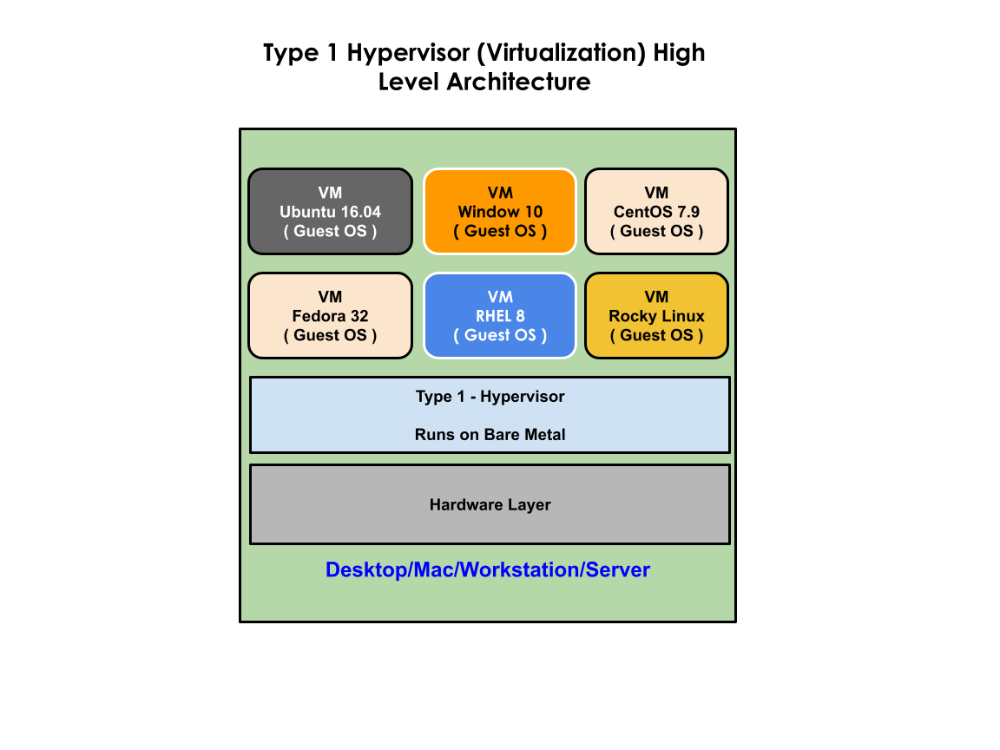
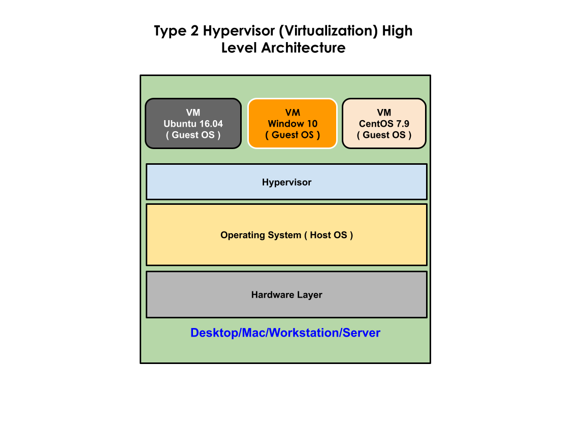
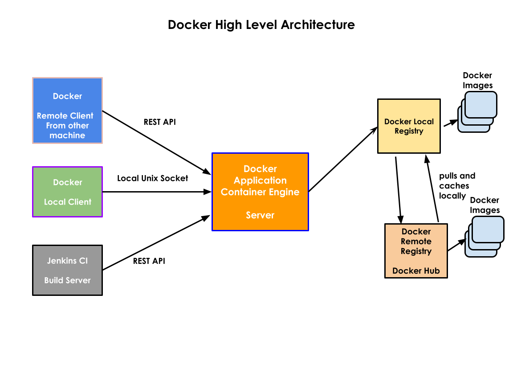

# Docker Overview

## Boot Loaders
   - Boot loader system utility that gets installed in MBR(Master Boot Record) of your Hard Disk
   - Whenever the system is booted, once BIOS system self-test is complete, it instructs the CPU to run the Boot Loader
   - Boot Loader then scans your hard disk looking for any OS
   - In case Boot Loader detects more than one OS installed on your system it then gives a menu
     for you to choose which OS you wish to boot into
   Examples below are 2 popular opensource Boot Loaders
   GRUB
    version 1
    version 2
   LILO (Linux Loaders)

## Virtualization
  - Hypervisor refers to Virtualization software
  - are of two types
    - Type - 1 ( runs on Bare metal - suitable for Workstations/Servers that are meant to host multiple VMs )
    - Type - 2 ( runs on Desktop/Workstations - suitable for your personal/official Laptops or primary work machine that has OS )
  - with this technology 
    - you can boot many OS side by side on the same PC/Desktop/Workstation/Server simultaneously
    - is a combination of Hardware + Software technology
  - Processors that supports Virtualization feature
    - Intel Processor
      - Virtualization Feature - VT-X
    - AMD Processor
      - Virtualization Feature - AMD-V
  - With HyperThreading(Intel) or AMD CMT (Clustered Multi-threading Enabled)
       - Intel/AMD core supports running 2 to 4 threads parallely
       - i.e each Physical CPU core will be seen as 2 virtual cores or in some latest processors as 4 virtual cores
       - hence if you have a Server Grade Processor with 512 cores, it may give you 512 x 2 = 1024 virtual cores or 
         512 x 4 = 2048 cores depending on the Processor available on the Server

  - Virtual Machines are assigned with Virtual Cores( aka Logical cores )
  - Heavy weight technology
      - Each Virtual Machines(VM) or the Guest OS requires dedicated hardware resources
        - Dedicated CPU cores
        - Dedicated RAM
        - Dedicated Storage
  
  - If you have a Processor that supports Virtualization, you need to ensure that the virtualization
    feature is enabled in the BIOS.

  - How many Virtual Machine(Guest OS) can be created in a PC/Workstation/Server
      - is limited by the Hardware resources available in the system
      - Primary factor is Processor( i.e number of cpu cores in the Processor )
      - Amount of Random Access Memory(RAM) available in the system
      - Storage ( Hard Disk capacity ) available in the system
     
  - Some vendor spectific virtualization softwares
    - VMWare
        - VMWare workstation Pro
        - VMWare Fusion ( Mac )
        - VMWare vSphere (Bare metal Hypervisor)
    - Microsoft
        - Hyper-v ( Comes with Windows 10 Pro or later out of the box )
    - Oracle
        - VirtualBox (Free)

    - Parallels ( Mac )
    - KVM
       - opensource and free
       - Kernel Virtual Manager


| Type 1 Hypervisor                       | Type 2 Hypervisor                        |
| --------------------------------------- | ---------------------------------------- |
|  |    |


## Let's say your organization needs 10000 webservers running in its own OS

### Without Virtualization Technology
   - It requires 10000 Physical servers

### Virtualization Technology Benefits
  - Assuming the Server has Dual Sockets with each Processor supporting 512 cores
  - with HyperThreading/CMT Enabled it will support 512 * 2 * 4 = 4096 virtual cores
  - Hence 3 Physical Servers can technically support 10000 Virtual Machines as opposed to 10000 Physical Servers
  - This results in huge cost-saving in terms of 
    - OS License required for 3 Servers in the place of separate OS License for 10000 Servers
    - Cost involved in buying 3 Physical Servers is much less compared to buying 10000 Physical Servers
    - less real-estate cost for leasing data-center space
    - less electricity bill as 3 servers will consume less power compared to 10000 Physical servers
    - less cost is involved in sound proofing as the server room for 3 servers will be very small compared to the 
      server room that has 10000 Physical servers

### Virtualization Technology Drawbacks
  - it is heavy weight
  - the number of VMs a Server supports depends on how many CPU cores that Processor supports 
  - RAM and Storage available in the Server
  - Server Grade Processors with more cores are way too expensive, though cheaper compared to buying separate servers
  - Developers/QA Team
      - need many Virtual Machines to setup a production like Dev/QA environment
      - if less Virtual Machines are available to Dev/QA certain issues can't be verified in Dev/QA environment
      - i.e many issues will only occur in Prod while those bugs can't be reproduced as Dev/QA uses a single machine to setup
        all the software components required to setup a single instance of their product
      - as Dev/QA team generally doesn't setup Firewall/Proxy between Frontend and Backend, many practical scenaries are ignored
        during their testing but in real world Production environment Firewall/Proxy are used and many Physical Servers 
        or many Virtual Machines are used to setup different software components required for a single instance of a Product.
      - Hence Dev/QA/Prod environments are way too different, this leads to many issues reported only in Production
  - it isn't cost-effective for an organization to give 10~15 VMs per Engineer

## Containerization
 - light weight virtualization technology
    - containers doesn't require dedicated hardwares resources unlike Virtualization technology
 - containers are application process
 - aka application virtualization
 - all the containers are normal application processess that share the same Host OS Kernel
 - containers are not Operating System
 - containers in many ways appear like an OS/VM
 - containers has their shell and file system
 - containers are allocated with IP address
 - containers has its own network stack ( 7 OSI Layers )
 - containers has its own NIC ( Network Interface Card - Software Defined Network )
 - is a Linux Technology
 - Linux Kernel supports
     1. Namespace - is used to separate or isolate containers from each other by letting them run it own namespace
     2. CGroups ( Control Groups )
         - resource quota allocation
         - i.e it helps in applying some restriction on how much CPU resources, RAM and Storage a particular container can use
         - this is required to ensure that one single container does'nt take up all the H/W resources leaving other containers
           starve for H/W resources



## ⛹️‍♂️ Lab - Checking the version of docker installed
```
docker --version
```
The expected output is
<pre>
(jegan@tektutor.org$)><b>docker --version</b>
Docker version 20.10.12, build e91ed57
</pre>

##  ⛹️‍♀️ Lab - Checking the status of Docker Application Engine (Daemon/Service)
```
sudo systemctl status docker
```
The expected output is
<pre>
jegan@tektutor.org$)><b>sudo sytemctl status docker</b>
sudo: sytemctl: command not found
(jegan@tektutor.org$)>sudo systemctl status docker
● docker.service - Docker Application Container Engine
   Loaded: loaded (/usr/lib/systemd/system/docker.service; enabled; vendor preset: disabled)
   Active: active (running) since Sun 2022-03-06 19:23:50 PST; 3h 42min ago
     Docs: https://docs.docker.com
 Main PID: 64145 (dockerd)
    Tasks: 14
   Memory: 40.5M
   CGroup: /system.slice/docker.service
           └─64145 /usr/bin/dockerd -H fd:// --containerd=/run/containerd/containerd.sock

Mar 06 19:23:48 tektutor.org dockerd[64145]: time="2022-03-06T19:23:48.110984142-08:00" level=i...rpc
Mar 06 19:23:48 tektutor.org dockerd[64145]: time="2022-03-06T19:23:48.111009882-08:00" level=i...rpc
Mar 06 19:23:48 tektutor.org dockerd[64145]: time="2022-03-06T19:23:48.477701245-08:00" level=i...t."
Mar 06 19:23:49 tektutor.org dockerd[64145]: time="2022-03-06T19:23:49.915307132-08:00" level=i...ss"
Mar 06 19:23:50 tektutor.org dockerd[64145]: time="2022-03-06T19:23:50.201200737-08:00" level=i...ng"
Mar 06 19:23:50 tektutor.org dockerd[64145]: time="2022-03-06T19:23:50.462895927-08:00" level=i...e."
Mar 06 19:23:50 tektutor.org dockerd[64145]: time="2022-03-06T19:23:50.515173237-08:00" level=i....12
Mar 06 19:23:50 tektutor.org dockerd[64145]: time="2022-03-06T19:23:50.515686639-08:00" level=i...on"
Mar 06 19:23:50 tektutor.org systemd[1]: Started Docker Application Container Engine.
Mar 06 19:23:50 tektutor.org dockerd[64145]: time="2022-03-06T19:23:50.571898030-08:00" level=i...ck"
Hint: Some lines were ellipsized, use -l to show in full.
</pre>

### ⛹️‍♂️ Lab - Downloading hello-world docker image from Docker Hub(Remote Registry) to Local Docker Registry
```
docker pull hello-world:latest
```

The expected ouput is
<pre>
jegan@tektutor.org:~$ <b>docker pull hello-world:latest</b>
latest: Pulling from library/hello-world
2db29710123e: Pull complete 
Digest: sha256:97a379f4f88575512824f3b352bc03cd75e239179eea0fecc38e597b2209f49a
Status: Downloaded newer image for hello-world:latest
docker.io/library/hello-world:latest
</pre>

### ⛹️‍♀️ Lab - Listing docker images from your local docker registry
```
docker images
```

The expected output is
<pre>
jegan@tektutor.org:~$ <b>docker images</b>
REPOSITORY                                TAG       IMAGE ID       CREATED        SIZE
docker.bintray.io/jfrog/artifactory-oss   latest    547c6957fc54   4 weeks ago    993MB
sonarqube                                 latest    4ac4842c584e   5 weeks ago    520MB
<b>hello-world                               latest    feb5d9fea6a5   5 months ago   13.3kB</b>
</pre>

## ⛹️‍♂️ Lab - Finding more details about your docker installation
```
docker info
```

The expected output is
<pre>
jegan@tektutor.org:~$ <b>docker info</b>
Client:
 Context:    default
 Debug Mode: false

Server:
 Containers: 2
  Running: 2
  Paused: 0
  Stopped: 0
 Images: 3
 Server Version: 20.10.7
 Storage Driver: overlay2
  Backing Filesystem: extfs
  Supports d_type: true
  Native Overlay Diff: true
  userxattr: false
 Logging Driver: json-file
 Cgroup Driver: cgroupfs
 Cgroup Version: 1
 Plugins:
  Volume: local
  Network: bridge host ipvlan macvlan null overlay
  Log: awslogs fluentd gcplogs gelf journald json-file local logentries splunk syslog
 Swarm: inactive
 Runtimes: io.containerd.runc.v2 io.containerd.runtime.v1.linux runc
 Default Runtime: runc
 Init Binary: docker-init
 containerd version: 
 runc version: 
 init version: 
 Security Options:
  apparmor
  seccomp
   Profile: default
 Kernel Version: 5.4.0-100-generic
 Operating System: Ubuntu 18.04.6 LTS
 OSType: linux
 Architecture: x86_64
 CPUs: 48
 Total Memory: 125.6GiB
 Name: tektutor
 ID: I3XQ:RESC:AIUK:6RVT:T34U:3CP5:GHLH:QWET:J52D:UV3O:G5B6:3WGE
 Docker Root Dir: /var/lib/docker
 Debug Mode: false
 Registry: https://index.docker.io/v1/
 Labels:
 Experimental: false
 Insecure Registries:
  127.0.0.0/8
 Live Restore Enabled: false

WARNING: No swap limit support
</pre>

## ⛹️‍♀️ Lab - Creating your first container
```
docker run hello-world:latest
```
The expected output is
<pre>
jegan@tektutor.org:~$ <b>docker run hello-world:latest</b>

Hello from Docker!
This message shows that your installation appears to be working correctly.

To generate this message, Docker took the following steps:
 1. The Docker client contacted the Docker daemon.
 2. The Docker daemon pulled the "hello-world" image from the Docker Hub.
    (amd64)
 3. The Docker daemon created a new container from that image which runs the
    executable that produces the output you are currently reading.
 4. The Docker daemon streamed that output to the Docker client, which sent it
    to your terminal.

To try something more ambitious, you can run an Ubuntu container with:
 $ docker run -it ubuntu bash

Share images, automate workflows, and more with a free Docker ID:
 https://hub.docker.com/

For more examples and ideas, visit:
 https://docs.docker.com/get-started/
</pre>

## ⛹️‍♂️ Lab - Listing currently running containers
```
docker ps
```

The expected output is
<pre>
</pre>

## ⛹️‍♀️ Lab - Listing all containers irrespective of their running statjegan@tektutor:~$ docker stop 12fc64f9d46d
us
```
docker ps -a
```
The expected output is
<pre>
</pre>

## ⛹️‍♂️ Lab - Listing only container ids of running containers
```
docker ps -aq
```
The expected output is
<pre>
</pre>

## ⛹️‍♀️ Lab - Rename a container
```
docker rename <old-container-name> <new-container-name>
```

The expected output is
<pre>
jegan@tektutor.org:~$ <b>docker ps -a</b>
CONTAINER ID   IMAGE                COMMAND    CREATED              STATUS                          PORTS     NAMES
74f23bc4b3d8   hello-world:latest   "/hello"   About a minute ago   Exited (0) About a minute ago             <b>sharp_wescoff</b>
jegan@tektutor.org:~$ <b>docker rename sharp_wescoff hello1</b>
jegan@tektutor.org:~$ <b>docker ps -a</b>
CONTAINER ID   IMAGE                COMMAND    CREATED         STATUS                     PORTS     NAMES
74f23bc4b3d8   hello-world:latest   "/hello"   3 minutes ago   Exited (0) 3 minutes ago             <b>hello1</b>
</pre>

## ⛹️‍♀️ Lab - Creating an ubuntu container in interactive mode
```
docker run -it --name ubuntu1 --hostname ubuntu1 ubuntu:16.04 /bin/bash
```

The expected output is
<pre>
jegan@tektutor.org:~$ <b>docker run -it --name ubuntu1 --hostname ubuntu1 ubuntu:16.04 /bin/bash</b>
Unable to find image 'ubuntu:16.04' locally
16.04: Pulling from library/ubuntu
58690f9b18fc: Pull complete 
b51569e7c507: Pull complete 
da8ef40b9eca: Pull complete 
fb15d46c38dc: Pull complete 
Digest: sha256:0f71fa8d4d2d4292c3c617fda2b36f6dabe5c8b6e34c3dc5b0d17d4e704bd39c
Status: Downloaded newer image for ubuntu:16.04
root@ubuntu1:/# hostname
ubuntu1
root@ubuntu1:/# hostname -i
172.17.0.2
root@ubuntu1:/# ls
bin   dev  home  lib64  mnt  proc  run   srv  tmp  var
boot  etc  lib   media  opt  root  sbin  sys  usr
root@ubuntu1:/# 
root@ubuntu1:/# exit
exit
</pre>

## ⛹️‍♀️ Lab - Finding more details about a docker image

You may observe ubuntu:16.04 docker image has got 4 layers. 
```
docker inspect ubuntu:16.04
```
The expected output is
<pre>
jegan@tektutor.org:~$ <b>docker inspect ubuntu:16.04</b>
[
    {
        "Id": "sha256:b6f50765242581c887ff1acc2511fa2d885c52d8fb3ac8c4bba131fd86567f2e",
        "RepoTags": [
            "ubuntu:16.04"
        ],
        "RepoDigests": [
            "ubuntu@sha256:0f71fa8d4d2d4292c3c617fda2b36f6dabe5c8b6e34c3dc5b0d17d4e704bd39c"
        ],
        "Parent": "",
        "Comment": "",
        "Created": "2021-08-31T01:21:30.672229355Z",
        "Container": "02b9813c58908ec4e449545066e8dfcff693ced2765493be69f64749f8b5ec70",
        "ContainerConfig": {
            "Hostname": "02b9813c5890",
            "Domainname": "",
            "User": "",
            "AttachStdin": false,
            "AttachStdout": false,
            "AttachStderr": false,
            "Tty": false,
            "OpenStdin": false,
            "StdinOnce": false,
            "Env": [
                "PATH=/usr/local/sbin:/usr/local/bin:/usr/sbin:/usr/bin:/sbin:/bin"
            ],
            "Cmd": [
                "/bin/sh",
                "-c",
                "#(nop) ",
                "CMD [\"/bin/bash\"]"
            ],
            "Image": "sha256:3bdb1b7ec7d0b0427c63c46bfc1b2e7e953771af26648b34d0bec9e558709a64",
            "Volumes": null,
            "WorkingDir": "",
            "Entrypoint": null,
            "OnBuild": null,
            "Labels": {}
        },
        "DockerVersion": "20.10.7",
        "Author": "",
        "Config": {
            "Hostname": "",
            "Domainname": "",
            "User": "",
            "AttachStdin": false,
            "AttachStdout": false,
            "AttachStderr": false,
            "Tty": false,
            "OpenStdin": false,
            "StdinOnce": false,
            "Env": [
                "PATH=/usr/local/sbin:/usr/local/bin:/usr/sbin:/usr/bin:/sbin:/bin"
            ],
            "Cmd": [
                "/bin/bash"
            ],
            "Image": "sha256:3bdb1b7ec7d0b0427c63c46bfc1b2e7e953771af26648b34d0bec9e558709a64",
            "Volumes": null,
            "WorkingDir": "",
            "Entrypoint": null,
            "OnBuild": null,
            "Labels": null
        },
        "Architecture": "amd64",
        "Os": "linux",
        "Size": 134821261,
        "VirtualSize": 134821261,
        "GraphDriver": {
            "Data": {
                "LowerDir": "/var/lib/docker/overlay2/b5459bbe2fbe63b77a9d01277b118da4d6e988f7aae69b445f197fc7447c55b0/diff:/var/lib/docker/overlay2/9db49c5f6dc09e6216361b946cb6a518922453262512730e0f588674adafa205/diff:/var/lib/docker/overlay2/6655de4b8265c6d5337d82591ea41c2cab26b9e05da272e489a79db7f255be96/diff",
                "MergedDir": "/var/lib/docker/overlay2/218a7b807be45e19c09f2b49a566d80a72d92e3aff8527ed3e60278253e32026/merged",
                "UpperDir": "/var/lib/docker/overlay2/218a7b807be45e19c09f2b49a566d80a72d92e3aff8527ed3e60278253e32026/diff",
                "WorkDir": "/var/lib/docker/overlay2/218a7b807be45e19c09f2b49a566d80a72d92e3aff8527ed3e60278253e32026/work"
            },
            "Name": "overlay2"
        },
        "RootFS": {
            "Type": "layers",
            <b>"Layers": [
                "sha256:be96a3f634de79f523f07c7e4e0216c28af45eb5776e7a6238a2392f71e01069",
                "sha256:df54c846128da3c71cc11b2150a3df39ec86fb170e299765daf6bb016a0705c2",
                "sha256:47ef83afae74745639f6738a05fe5320fcfca9e6c7765fba4f25e270bc0df9dc",
                "sha256:1251204ef8fc20da275e09f6e3ab9205421d4ff34732f2d50a1d3e86d2995edd"
            ]</b>
        },
        "Metadata": {
            "LastTagTime": "0001-01-01T00:00:00Z"
        }
    }
]
</pre>

## ⛹️‍♂️ Lab - Stopping a single running container
```
docker stop <container-name>
```
The expected output is
<pre>
jegan@tektutor.org:~$ <b>docker ps</b>
CONTAINER ID   IMAGE     COMMAND   CREATED   STATUS    PORTS     NAMES
jegan@tektutor.org:~$ <b>docker ps -a</b>
CONTAINER ID   IMAGE          COMMAND       CREATED          STATUS                     PORTS     NAMES
12fc64f9d46d   ubuntu:16.04   "/bin/bash"   13 minutes ago   Exited (0) 9 minutes ago             ubuntu1
jegan@tektutor.org:~$ <b>docker start ubuntu1</b>
ubuntu1
jegan@tektutor.org:~$ <b>docker ps</b>
CONTAINER ID   IMAGE          COMMAND       CREATED          STATUS         PORTS     NAMES
12fc64f9d46d   ubuntu:16.04   "/bin/bash"   13 minutes ago   Up 3 seconds             ubuntu1
jegan@tektutor.org:~$ <b>docker stop 12fc64f9d46d</b>
12fc64f9d46d
jegan@tektutor.org:~$ <b>docker ps -a</b>
CONTAINER ID   IMAGE          COMMAND       CREATED          STATUS                      PORTS     NAMES
12fc64f9d46d   ubuntu:16.04   "/bin/bash"   16 minutes ago   Exited (0) 14 seconds ago             ubuntu1
jegan@tektutor.org:~$ <b>docker start ubuntu1</b>
ubuntu1
jegan@tektutor.org:~$ <b>docker ps -a</b>
CONTAINER ID   IMAGE          COMMAND       CREATED          STATUS         PORTS     NAMES
12fc64f9d46d   ubuntu:16.04   "/bin/bash"   16 minutes ago   Up 4 seconds             ubuntu1
jegan@tektutor.org:~$ <b>docker stop ubuntu1</b>
ubuntu1
jegan@tektutor.org:~$ <b>docker ps -a</b>
CONTAINER ID   IMAGE          COMMAND       CREATED          STATUS                     PORTS     NAMES
12fc64f9d46d   ubuntu:16.04   "/bin/bash"   16 minutes ago   Exited (0) 3 seconds ago             ubuntu1
</pre>

## ⛹️‍♀️ Lab - Starting a container that isn't running currently

You may replace the container-name with container id as well.
```
docker start <container-name>
```

The expected output is
<pre>
jegan@tektutor.org:~$ <b>docker ps -a</b>
CONTAINER ID   IMAGE          COMMAND       CREATED          STATUS                     PORTS     NAMES
12fc64f9d46d   ubuntu:16.04   "/bin/bash"   13 minutes ago   Exited (0) 9 minutes ago             ubuntu1
jegan@tektutor.org:~$ <b>docker start ubuntu1</b>
ubuntu1
jegan@tektutor.org:~$ <b>docker ps</b>
CONTAINER ID   IMAGE          COMMAND       CREATED          STATUS         PORTS     NAMES
12fc64f9d46d   ubuntu:16.04   "/bin/bash"   13 minutes ago   Up 3 seconds             ubuntu1
</pre>

## ⛹️‍♀️ Lab - Restarting a container that is either running or not running currently

You may replace the container-name with container id as well.
```
docker restart <container-name>
```

The expected output is
<pre>
</pre>

## ⛹️‍♂️ Lab - Find the IP Address of a running container
```
docker inspect <container-name> | grep IPA
```
The expected output is
<pre>
</pre>

## ⛹️‍♀️ Lab - Stopping all containers and removing them gracefully
```
docker stop $(docker ps -aq) && docker rm $(docker ps -aq)
```

The expected output is
<pre>

</pre>

## ⛹️‍♂️ Lab - Removing a single exited container
```
docker rm <container-name>
docker rm <container-id>
```
The expected output is
<pre>
jegan@tektutor.org:~$ <b>docker ps -a</b>
CONTAINER ID   IMAGE                COMMAND    CREATED         STATUS                     PORTS     NAMES
74f23bc4b3d8   hello-world:latest   "/hello"   3 minutes ago   Exited (0) 3 minutes ago             hello1
jegan@tektutor.org:~$ <b>docker rm hello1</b>
hello1
jegan@tektutor.org:~$ <b>docker ps -a</b>
CONTAINER ID   IMAGE     COMMAND   CREATED   STATUS    PORTS     NAMES
</pre>

## Removing all containers forcibly
```
docker rm -f $(docker ps -aq)
```
The expected output is
<pre>
</pre>

## Let's dispose all containers
```
docker stop $(docker ps -q) && docker rm $(docker ps -aq)
```

## Let's create multiple containers
```
docker run -dit --name c1 --hostname c1 ubuntu:16.04 /bin/bash
docker run -dit --name c2 --hostname c2 ubuntu:16.04 /bin/bash
docker run -dit --name c3 --hostname c3 ubuntu:18.04 /bin/bash
docker run -dit --name ubuntu1 --hostname ubuntu1 ubuntu:16.04 /bin/bash
docker run -dit --name ubuntu2 --hostname ubuntu2 ubuntu:16.04 /bin/bash
docker run -dit --name ubuntu3 --hostname ubuntu3 ubuntu:16.04 /bin/bash
```

The expected output is
<pre>
jegan@tektutor.org:~$ docker run -dit --name c1 --hostname c1 ubuntu:16.04 /bin/bash
d7d967b44e66dea236e53a4601d7de4b1b084dec2c689d207b4c3a56020d2402
jegan@tektutor.org:~$ docker run -dit --name c2 --hostname c2 ubuntu:16.04 /bin/bash
c2300b0295720269c5cbc46e476e30b8dafb8f74e56a54b0b392f8a170e758cb
jegan@tektutor.org:~$ docker run -dit --name c3 --hostname c3 ubuntu:18.04 /bin/bash
56fa26cafe8185005ec95fad4cff1462f0125aec1e0541dea293c99493b0cb51
jegan@tektutor.org:~$ docker run -dit --name ubuntu1 --hostname ubuntu1 ubuntu:16.04 /bin/bash
c3d8d619df9b3d9bdf6393d6ea423d9f05997209afe041c6e15991bfdd288232
jegan@tektutor.org:~$ docker run -dit --name ubuntu2 --hostname ubuntu2 ubuntu:16.04 /bin/bash
65f057bca098a3e6b6fb243cd2cdd63a2e28a6c20607bfd8166e459c4e9887ab
jegan@tektutor.org:~$ docker run -dit --name ubuntu3 --hostname ubuntu3 ubuntu:16.04 /bin/bash
e7167bb5e79765bfdcead88f9fe3b2018279650344135e5fec0c61a6c9887729
</pre>

List all the containers
```
docker ps
```

The expected output is
<pre>
jegan@tektutor.org:~$ docker ps
CONTAINER ID   IMAGE          COMMAND       CREATED          STATUS          PORTS     NAMES
e7167bb5e797   ubuntu:16.04   "/bin/bash"   47 seconds ago   Up 46 seconds             ubuntu3
65f057bca098   ubuntu:16.04   "/bin/bash"   50 seconds ago   Up 48 seconds             ubuntu2
c3d8d619df9b   ubuntu:16.04   "/bin/bash"   50 seconds ago   Up 49 seconds             ubuntu1
56fa26cafe81   ubuntu:18.04   "/bin/bash"   51 seconds ago   Up 49 seconds             c3
c2300b029572   ubuntu:16.04   "/bin/bash"   51 seconds ago   Up 50 seconds             c2
d7d967b44e66   ubuntu:16.04   "/bin/bash"   52 seconds ago   Up 50 seconds             c1
</pre>

Let us stop c3 container
```
docker stop c3
docker ps -a -f ancestor=ubuntu:18.04
```
Let us now list all running containers whose image is ubuntu:18.04
<pre>
jegan@tektutor.org:~$ docker ps -a -f ancestor=ubuntu:18.04
CONTAINER ID   IMAGE          COMMAND       CREATED         STATUS                      PORTS     NAMES
56fa26cafe81   ubuntu:18.04   "/bin/bash"   2 minutes ago   Exited (0) 21 seconds ago             c3
</pre>


List all containers which are in running state using filter
```
docker ps --filter status=running
```

The expected output is
<pre>
jegan@tektutor.org:~$ docker ps --filter status=running
CONTAINER ID   IMAGE          COMMAND       CREATED         STATUS         PORTS     NAMES
e7167bb5e797   ubuntu:16.04   "/bin/bash"   4 minutes ago   Up 4 minutes             ubuntu3
65f057bca098   ubuntu:16.04   "/bin/bash"   4 minutes ago   Up 4 minutes             ubuntu2
c3d8d619df9b   ubuntu:16.04   "/bin/bash"   4 minutes ago   Up 4 minutes             ubuntu1
c2300b029572   ubuntu:16.04   "/bin/bash"   4 minutes ago   Up 4 minutes             c2
d7d967b44e66   ubuntu:16.04   "/bin/bash"   4 minutes ago   Up 4 minutes             c1
</pre>


List all containers which are in exited state using filter
```
docker ps --filter status=exited
```

The expected output is
<pre>
jegan@tektutor.org:~$ docker ps --filter status=exited
CONTAINER ID   IMAGE          COMMAND       CREATED         STATUS                     PORTS     NAMES
56fa26cafe81   ubuntu:18.04   "/bin/bash"   5 minutes ago   Exited (0) 4 minutes ago             c3
</pre>

List all containers which are in exited state and their image is ubuntu:18.04
```
docker ps --filter status=exited --filter ancestor=ubuntu:18.04
```

The expected output is
<pre>
jegan@tektutor.org:~$ docker ps --filter status=exited --filter ancestor=ubuntu:18.04
CONTAINER ID   IMAGE          COMMAND       CREATED         STATUS                     PORTS     NAMES
56fa26cafe81   ubuntu:18.04   "/bin/bash"   8 minutes ago   Exited (0) 7 minutes ago             c3
</pre>

## ⛹️‍♂️ Lab - Creating mysql container in background (deattached) mode
```
docker run -d --name db1 --hostname db1 -e MYSQL_ROOT_PASSWORD=root mysql:latest
```

The expected output is

<pre>
jegan@tektutor.org:~$ <b>docker run -d --name db1 --hostname db1 -e MYSQL_ROOT_PASSWORD=root mysql:latest</b>
Unable to find image 'mysql:latest' locally
latest: Pulling from library/mysql
15115158dd02: Pull complete 
d733f6778b18: Pull complete 
1cc7a6c74a04: Pull complete 
c4364028a805: Pull complete 
82887163f0f6: Pull complete 
097bfae26e7a: Pull complete 
e1b044d6a24f: Pull complete 
cd2978bd4d12: Pull complete 
28bce5cc1677: Pull complete 
907b6d695760: Pull complete 
c5049403458b: Pull complete 
f360718d6f4e: Pull complete 
Digest: sha256:0eb33f0094ef5351639d9d9847c963ee9f22f5631cde046babd4ec239aaeaf06
Status: Downloaded newer image for mysql:latest
ae04c45f030c49a66f994570a33dc053802a9221b92a3e2e0cb83f7eba62f34e
</pre>

List and see if the mysql container is running as expected
```
docker ps
```
The expected output is
<pre>
jegan@tektutor.org:~$ <b>docker ps</b>
CONTAINER ID   IMAGE          COMMAND                  CREATED         STATUS         PORTS                 NAMES
ae04c45f030c   mysql:latest   "docker-entrypoint.s…"   2 minutes ago   Up 2 minutes   3306/tcp, 33060/tcp   db1
</pre>

Getting inside the mysql container
```
docker exec -it db1 sh
hostname
hostname -i
```

The expected output is
<pre>
jegan@tektutor.org:~$ docker exec -it db1 sh
# hostname
db1
# ls
bin   dev			  entrypoint.sh  home  lib64  mnt  proc  run   srv  tmp  var
boot  docker-entrypoint-initdb.d  etc		 lib   media  opt  root  sbin  sys  usr
# hostname -i
172.17.0.2
</pre>

Connecting to mysql server
```
mysql -u root -p
```
When it prompts for password type 'root' as the password without the quotes.

The expected ouptut is
<pre>
# mysql -u root -p 
Enter password: 
Welcome to the MySQL monitor.  Commands end with ; or \g.
Your MySQL connection id is 8
Server version: 8.0.28 MySQL Community Server - GPL

Copyright (c) 2000, 2022, Oracle and/or its affiliates.

Oracle is a registered trademark of Oracle Corporation and/or its
affiliates. Other names may be trademarks of their respective
owners.

Type 'help;' or '\h' for help. Type '\c' to clear the current input statement.

mysql> 
</pre>

Let's create a database, create a table in it and add some records as shown below
```
SHOW DATABASES;
CREATE DATABASE tektutor;
USE tektutor;
CREATE TABLE Training ( name VARCHAR(55), duration VARCHAR(30) );
INSERT INTO Training VALUES ( "DevOps", "3 Days" );
INSERT INTO Training VALUES ( "Microservices", "5 Days" );
INSERT INTO Training VALUES ( "OpenShift CI/CD with Tekton", "5 Days" );
SELECT * FROM Training;
exit
exit
docker rm -f db1
```

The expected output is
<pre>
mysql> <b>SHOW DATABASES;</b>
+--------------------+
| Database           |
+--------------------+
| information_schema |
| mysql              |
| performance_schema |
| sys                |
+--------------------+
4 rows in set (0.01 sec)

mysql> <b>CREATE DATABASE tektutor;</b>
Query OK, 1 row affected (0.01 sec)

mysql> <b>USE tektutor;</b>
Database changed
mysql> <b>SHOW TABLES;</b>
Empty set (0.00 sec)

mysql> <b>CREATE TABLE Training ( name VARCHAR(55), duration VARCHAR(30) );</b>
Query OK, 0 rows affected (0.02 sec)

mysql> <b>INSERT INTO Training VALUES ( "DevOps", "3 Days" );</b>
Query OK, 1 row affected (0.01 sec)

mysql> <b>INSERT INTO Training VALUES ( "Microservices", "5 Days" );</b>
Query OK, 1 row affected (0.01 sec)

mysql> <b>INSERT INTO Training VALUES ( "OpenShift CI/CD with Tekton", "5 Days" );</b>
Query OK, 1 row affected (0.00 sec)

mysql> <b>SELECT * FROM Training;</b>
+-----------------------------+----------+
| name                        | duration |
+-----------------------------+----------+
| DevOps                      | 3 Days   |
| Microservices               | 5 Days   |
| OpenShift CI/CD with Tekton | 5 Days   |
+-----------------------------+----------+
3 rows in set (0.00 sec)

mysql> 
mysql> exit
Bye
# exit
</pre>

Let's delete the mysql container
```
docker rm -f db1
```
The expected output is
<pre>
jegan@tektutor:~$ docker rm -f db1
db1
</pre>

Let's see if the data inserted will be available once the db1 container is removed
```
docker rm -f db1
docker run -d --name db1 --hostname db1 -e MYSQL_ROOT_PASSWORD=root mysql:latest
docker exec -it db1 sh
mysql -u root -p 
SHOW DATABASES;
```

The expected output is
<pre>
jegan@tektutor.org:~$ docker rm -f db1
db1
jegan@tektutor.org:~$ docker run -d --name db1 --hostname db1 -e MYSQL_ROOT_PASSWORD=root mysql:latest
2da413c6eff6015ff636b107becedc6fd42aad2583f82b1556232dddbafbf491
jegan@tektutor.org:~$ docker exec -it db1 sh
# mysql -u root -p 
Enter password: 
Welcome to the MySQL monitor.  Commands end with ; or \g.
Your MySQL connection id is 8
Server version: 8.0.28 MySQL Community Server - GPL

Copyright (c) 2000, 2022, Oracle and/or its affiliates.

Oracle is a registered trademark of Oracle Corporation and/or its
affiliates. Other names may be trademarks of their respective
owners.

Type 'help;' or '\h' for help. Type '\c' to clear the current input statement.

mysql> SHOW DATABASES;
+--------------------+
| Database           |
+--------------------+
| information_schema |
| mysql              |
| performance_schema |
| sys                |
+--------------------+
4 rows in set (0.00 sec)

mysql> 
</pre>

As we can see, the 'tektutor' database is missing.

## ⛹️‍♀️ Lab - Using Persistent Volume to store database external to a container

We need to create a directory as non-root user
```
mkdir -p /tmp/mysql
```
The expected output is
<pre>
jegan@tektutor.org:~$ mkdir -p /tmp/mysql
</pre>

Let's create a new db1 mysql container using /tmp/mysql local hostpath as the persistent volume which is mounted inside the container at path /var/lib/mysql.
```
docker run -d --name db1 --hostname db1 -v /tmp/mysql:/var/lib/mysql mysql:latest 
docker ps 
```

The expected output is
<pre>
jegan@tektutor.org:~$ docker run -d --name db1 --hostname db1 -e MYSQL_ROOT_PASSWORD=root -v /tmp/mysql:/var/lib/mysql mysql:latest
65239ff45071700bbc43795b8520ba90b77fdeee7de10fa3730894308c70f1c6
jegan@tektutor.org:~$ docker ps
CONTAINER ID   IMAGE          COMMAND                  CREATED         STATUS        PORTS                 NAMES
65239ff45071   mysql:latest   "docker-entrypoint.s…"   3 seconds ago   Up 1 second   3306/tcp, 33060/tcp   db1
</pre>

Now let's get inside the container
```
docker exec -it db1 sh
mysql -u root -p
SHOW DATABASES;
CREATE DATABASE tektutor;
USE tektutor;
CREATE TABLE Training ( name VARCHAR(50), duration VARCHAR(30) );
INSERT INTO Training VALUES ( "DevOps", "3 Days" );
INSERT INTO Training VALUES ( "Microservices", "5 Days" );
INSERT INTO Training VALUES ( "OpenShift CI/CD with Tekton", "5 Days" );
SELECT * FROM Training;
exit
exit
```

The expected output is
<pre>
jegan@tektutor:~$ docker exec -it db1 sh
# mysql -u root -p 
Enter password: 
Welcome to the MySQL monitor.  Commands end with ; or \g.
Your MySQL connection id is 8
Server version: 8.0.28 MySQL Community Server - GPL

Copyright (c) 2000, 2022, Oracle and/or its affiliates.

Oracle is a registered trademark of Oracle Corporation and/or its
affiliates. Other names may be trademarks of their respective
owners.

Type 'help;' or '\h' for help. Type '\c' to clear the current input statement.

mysql> SHOW DATABASES;
+--------------------+
| Database           |
+--------------------+
| information_schema |$(jegan@master.tektutor.org) > docker run -dit --name ubuntu2 --hostname ubuntu2 --network=my-net-2 ubuntu:16.04 /bin/bash
8def943d993652f785ab2f0b97febf19b1fda11f121b9c83e05f76b01838216c

| mysql              |
| performance_schema |
| sys                |
+--------------------+
4 rows in set (0.00 sec)

mysql> CREATE DATABASE tektutor;
Query OK, 1 row affected (0.01 sec)

mysql> USE tektutor;
Database changed
mysql> CREATE TABLE Training ( name VARCHAR(50), duration VARCHAR(30) );
Query OK, 0 rows affected (0.02 sec)

mysql> INSERT INTO Training VALUES ( "DevOps", "3 Days" );
Query OK, 1 row affected (0.01 sec)

mysql> INSERT INTO Training VALUES ( "Microservices", "5 Days" );
Query OK, 1 row affected (0.00 sec)

mysql> INSERT INTO Training VALUES ( "OpenShift CI/CD with Tekton", "5 Days" );
Query OK, 1 row affected (0.01 sec)

mysql> SELECT * FROM Training;
+-----------------------------+----------+
| name                        | duration |
+-----------------------------+----------+
| DevOps                      | 3 Days   |
| Microservices               | 5 Days   |
| OpenShift CI/CD with Tekton | 5 Days   |
+-----------------------------+----------+
3 rows in set (0.00 sec)

mysql> exit
Bye
# exit
jegan@tektutor.org:~$ docker rm -f db1
db1
</pre>

Though we deleted the db1 container through which we created 'tektutor' database and 'Training' table inside database 'tektutor'.  The data will be intact as we used external volume i.e /tmp/mysql hostpath.

To verify if the data is still there, we will create a new container mounting the same volume
```
docker run -d --name db1 --hostname db1 -e MYSQL_ROOT_PASSWORD=root -v /tmp/mysql:/var/lib/mysql mysql:latest
docker exec -it db1 sh
mysql -u root -p
SHOW DATABASES;
USE tektutor;
SELECT * FROM Training;
```

The expected output is
<pre>
jegan@tektutor.org:~$ docker run -d --name db1 --hostname db1 -e MYSQL_ROOT_PASSWORD=root -v /tmp/mysql:/var/lib/mysql mysql:latest
34277dd48a895d12673bd89a715f86fc09acee0f454728d01687b65f04b6bb0f
jegan@tektutor.org:~$ docker exec -it db1 sh
# mysql -u root -p
Enter password: 
Welcome to the MySQL monitor.  Commands end with ; or \g.
Your MySQL connection id is 8
Server version: 8.0.28 MySQL Community Server - GPL

Copyright (c) 2000, 2022, Oracle and/or its affiliates.

Oracle is a registered trademark of Oracle Corporation and/or its
affiliates. Other names may be trademarks of their respective
owners.

Type 'help;' or '\h' for help. Type '\c' to clear the current input statement.

mysql> SHOW DATABASES;
+--------------------+
| Database           |
+--------------------+
| information_schema |
| mysql              |
| performance_schema |
| sys                |
| tektutor           |
+--------------------+
5 rows in set (0.01 sec)

mysql> USE tektutor;
Reading table information for completion of table and column names
You can turn off this feature to get a quicker startup with -A

Database changed
mysql> SHOW TABLES;
+--------------------+
| Tables_in_tektutor |
+--------------------+
| Training           |
+--------------------+
1 row in set (0.00 sec)

mysql> SELECT * FROM Training;
+-----------------------------+----------+
| name                        | duration |
+-----------------------------+----------+
| DevOps                      | 3 Days   |
| Microservices               | 5 Days   |
| OpenShift CI/CD with Tekton | 5 Days   |
+-----------------------------+----------+
3 rows in set (0.00 sec)

mysql> exit
Bye
# exit
</pre>

As you can use, the database and table with data is intact. All credit goes to the Docker volume mounting feature :)

# Docker Networking

## ⛹️‍♂️ Lab - Listing docker network types 
```
docker network ls
```

<pre>
jegan@tektutor.org:~$ <b>docker network ls</b>
NETWORK ID     NAME      DRIVER    SCOPE
00305de8fb69   bridge    bridge    local
9371e925f813   host      host      local
7c9fa6ea53f0   none      null      local
</pre>

Bridge is the default type of network used by Docker.

## ⛹️‍♀️ Lab - Verify how many network inferaces are available in your lab machine
```
ifconfig
```
You are expected to see an output similar to below
<pre>
$(jegan@master.tektutor.org) > <b>ifconfig</b>
<b>docker0</b>: flags=4099<UP,BROADCAST,MULTICAST>  mtu 1500
        inet 172.17.0.1  netmask 255.255.0.0  broadcast 172.17.255.255
        ether 02:42:36:d8:49:8d  txqueuelen 0  (Ethernet)
        RX packets 0  bytes 0 (0.0 B)
        RX errors 0  dropped 0  overruns 0  frame 0
        TX packets 0  bytes 0 (0.0 B)
        TX errors 0  dropped 0 overruns 0  carrier 0  collisions 0

<b>ens33</b>: flags=4163<UP,BROADCAST,RUNNING,MULTICAST>  mtu 1500
        inet 192.168.167.134  netmask 255.255.255.0  broadcast 192.168.167.255
        inet6 fe80::f473:e071:f35b:8868  prefixlen 64  scopeid 0x20<link>
        ether 00:0c:29:de:d4:ed  txqueuelen 1000  (Ethernet)
        RX packets 81246  bytes 64372430 (61.3 MiB)
        RX errors 0  dropped 0  overruns 0  frame 0
        TX packets 43871  bytes 6027400 (5.7 MiB)
        TX errors 0  dropped 0 overruns 0  carrier 0  collisions 0

<b>lo</b>: flags=73<UP,LOOPBACK,RUNNING>  mtu 65536
        inet 127.0.0.1  netmask 255.0.0.0
        inet6 ::1  prefixlen 128  scopeid 0x10<host>
        loop  txqueuelen 1000  (Local Loopback)
        RX packets 32  bytes 2592 (2.5 KiB)
        RX errors 0  dropped 0  overruns 0  frame 0
        TX packets 32  bytes 2592 (2.5 KiB)
        TX errors 0  dropped 0 overruns 0  carrier 0  collisions 0

<b>virbr0</b>: flags=4099<UP,BROADCAST,MULTICAST>  mtu 1500
        inet 192.168.122.1  netmask 255.255.255.0  broadcast 192.168.122.255
        ether 52:54:00:b7:aa:ea  txqueuelen 1000  (Ethernet)
        RX packets 0  bytes 0 (0.0 B)
        RX errors 0  dropped 0  overruns 0  frame 0
        TX packets 0  bytes 0 (0.0 B)
        TX errors 0  dropped 0 overruns 0  carrier 0  collisions 0
</pre>

In the above output, <b>docker0</b> is the default bridge created by Docker.  While creating containers if the user
hasn't mentioned a custom network to which the container must be connected, then by default it gets connected to the <b>docker0</b> bridge network.  The <b>docker0</b> bridge network has a subnet <b>172.17.0.0/16</b>.  Out of which <b>172.17.0.1</b> is assigned to the <b>docker0</b> bridge device which acts as a Gateway for all the containers that are part of <b>docker0</b> bridge network.

<b>ens33</b> is the Network Interface Card i.e Virtual ethernet device created by VMware Workstation as this machine is a Guest OS created within VMWare Workstation Pro.

<b>lo</b> is the loopback network interface that connects to itself.  This is useful for testing network applications in the absence of any other network.

<b>virbr0</b> is the virtual bridge device created by VMWare to make this machine act as a Hypervisor machine.

## Create two custom docker network
Listing the networks before creating custom networks
```
docker network ls
```
The expected output is
<pre>
$(jegan@master.tektutor.org) > <b>docker network ls</b>
<b>NETWORK ID     NAME              DRIVER    SCOPE</b>
1b28eed46dd4   bridge            bridge    local
bf60ab8473f9   host              host      local
6830e8866357   none              null      local
</pre>

```
docker network create my-net-1
docker network create my-net-2
```

The expected output is
<pre>
$(jegan@master.tektutor.org) > <b>docker network create my-net-1</b>
ef5e3eeed41ce4e111a58f7997a1674b51eae7cace9ed6a2eda89902e3283fd2
$(jegan@master.tektutor.org) > <b>docker network create my-net-2</b>
07888c842705a2018b0a4f1cbdd26b127b2d6bcb48b339e58ebf30277a113cdb
</pre>

Listing the network after creating our custom networks
```
docker network ls
```

The expected output is
<pre>
$(jegan@master.tektutor.org) > <b>docker network ls</b>
<b>NETWORK ID     NAME              DRIVER    SCOPE</b>
1b28eed46dd4   bridge            bridge    local
bf60ab8473f9   host              host      local
<b>ef5e3eeed41c   my-net-1          bridge    local
07888c842705   my-net-2          bridge    local</b>
6830e8866357   none              null      local
</pre>

Let's dispose any containers running in our lab machine
```
docker rm -f $(docker ps -aq)
```

Let us now create two containers and connect them to one of the custom networks we created above
```
docker run -dit --name ubuntu1 --hostname ubuntu1 --network=my-net-1 ubuntu:16.04 /bin/bash
docker run -dit --name ubuntu2 --hostname ubuntu2 --network=my-net-2 ubuntu:16.04 /bin/bash
```
The expected output is
<pre>
$(jegan@master.tektutor.org) > <b>docker run -dit --name ubuntu1 --hostname ubuntu1 --network=my-net-1 ubuntu:16.04 /bin/bash</b>
Unable to find image 'ubuntu:16.04' locally
16.04: Pulling from library/ubuntu
58690f9b18fc: Pull complete 
b51569e7c507: Pull complete 
da8ef40b9eca: Pull complete 
fb15d46c38dc: Pull complete 
Digest: sha256:0f71fa8d4d2d4292c3c617fda2b36f6dabe5c8b6e34c3dc5b0d17d4e704bd39c
Status: Downloaded newer image for ubuntu:16.04
6fab05cb278040bf1d6b39606e010093c09328dc894e297badf5acc88f60925c

$(jegan@master.tektutor.org) > <b>docker run -dit --name ubuntu2 --hostname ubuntu2 --network=my-net-2 ubuntu:16.04 /bin/bash</b>
8def943d993652f785ab2f0b97febf19b1fda11f121b9c83e05f76b01838216c
</pre>

Listing the containers
```
docker ps
```
The expected output is
<pre>
$(jegan@master.tektutor.org) > <b>docker ps</b>
CONTAINER ID   IMAGE          COMMAND              CREATED              STATUS              PORTS     NAMES
<b>8def943d9936   ubuntu:16.04   "/bin/bash"          3 seconds ago        Up 2 seconds                  ubuntu2</b>
<b>6fab05cb2780   ubuntu:16.04   "/bin/bash"          About a minute ago   Up About a minute             ubuntu1</b>
</pre>

Get inside ubuntu1 container and install network tools and ping utilities
```
docker exec -it ubuntu1 bash
apt update && apt install -y net-tools iputils-ping
```
The expected output is
<pre>
$(jegan@master.tektutor.org) > docker exec -it ubuntu1 bash
root@ubuntu1:/# apt update && apt install -y net-tools iputils-ping
Get:1 http://security.ubuntu.com/ubuntu xenial-security InRelease [99.8 kB]
Get:2 http://archive.ubuntu.com/ubuntu xenial InRelease [247 kB]
Get:3 http://security.ubuntu.com/ubuntu xenial-security/main amd64 Packages [2051 kB]
Get:4 http://archive.ubuntu.com/ubuntu xenial-updates InRelease [99.8 kB]        
Get:5 http://archive.ubuntu.com/ubuntu xenial-backports InRelease [97.4 kB]       
Get:6 http://archive.ubuntu.com/ubuntu xenial/main amd64 Packages [1558 kB]        
Get:7 http://archive.ubuntu.com/ubuntu xenial/restricted amd64 Packages [14.1 kB]
Get:8 http://archive.ubuntu.com/ubuntu xenial/universe amd64 Packages [9827 kB]  
Get:9 http://security.ubuntu.com/ubuntu xenial-security/restricted amd64 Packages [15.9 kB]
Get:10 http://security.ubuntu.com/ubuntu xenial-security/universe amd64 Packages [984 kB]
Get:11 http://security.ubuntu.com/ubuntu xenial-security/multiverse amd64 Packages [8820 B]
60% [8 Packages 5623 kB/9827 kB 57%]                                                                                                        67% [8 Packages 7218 kB/9827 kB 73%]                                                                                                        67% [8 Packages 7218 kB/9827 kB 73%]                                                                                                        67% [8 Packages 7381 kB/9827 kB 75%]                                                                                                        77% [8 Packages 9652 kB/9827 kB 98%]                                                                                                        78% [Waiting for headers]                                                                                                                                                                                                                                                               Get:12 http://archive.ubuntu.com/ubuntu xenial/multiverse amd64 Packages [176 kB]
78% [12 Packages 17.4 kB/176 kB 10%]                                                                                                        78% [8 Packages store 0 B] [12 Packages 17.4 kB/176 kB 10%]                                                                                 78% [8 Packages store 0 B]                                                                                                                                                                                                                                                              Get:13 http://archive.ubuntu.com/ubuntu xenial-updates/main amd64 Packages [2560 kB]
78% [8 Packages store 0 B] [13 Packages 0 B/2560 kB 0%]                                                                                     83% [8 Packages store 0 B] [13 Packages 1185 kB/2560 kB 46%]                                                                                88% [13 Packages 2262 kB/2560 kB 88%]                                                                                                       88% [12 Packages store 0 B] [13 Packages 2266 kB/2560 kB 89%]                                                                               89% [13 Packages 2311 kB/2560 kB 90%]                                                                                                       90% [Working]                                                                                                                                                                                                                                                                           Get:14 http://archive.ubuntu.com/ubuntu xenial-updates/restricted amd64 Packages [16.4 kB]
90% [14 Packages 4700 B/16.4 kB 29%]                                                                                                        90% [13 Packages store 0 B] [14 Packages 4700 B/16.4 kB 29%]                                                                                90% [13 Packages store 0 B]                                                                                                                                                                                                                                                             Get:15 http://archive.ubuntu.com/ubuntu xenial-updates/universe amd64 Packages [1544 kB]
90% [13 Packages store 0 B] [15 Packages 3550 B/1544 kB 0%]                                                                                 93% [15 Packages 484 kB/1544 kB 31%]                                                                                                        93% [14 Packages store 0 B] [15 Packages 484 kB/1544 kB 31%]                                                                                93% [15 Packages 507 kB/1544 kB 33%]                                                                                                        98% [Waiting for headers]                                                                                                                                                                                                                                                               Get:16 http://archive.ubuntu.com/ubuntu xenial-updates/multiverse amd64 Packages [26.2 kB]
98% [16 Packages 5421 B/26.2 kB 21%]                                                                                                        98% [15 Packages store 0 B] [16 Packages 5421 B/26.2 kB 21%]                                                                                98% [15 Packages store 0 B]                                                                                                                                                                                                                                                             Get:17 http://archive.ubuntu.com/ubuntu xenial-backports/main amd64 Packages [10.9 kB]
98% [15 Packages store 0 B] [17 Packages 4750 B/10.9 kB 43%]                                                                                98% [15 Packages store 0 B] [Waiting for headers]                                                                                                                                                                                                                                       Get:18 http://archive.ubuntu.com/ubuntu xenial-backports/universe amd64 Packages [12.7 kB]
98% [15 Packages store 0 B] [18 Packages 0 B/12.7 kB 0%]                                                                                    98% [15 Packages store 0 B]                                                                                                                 98% [Working]                                                                                                                               98% [16 Packages store 0 B]                                                                                                                 99% [Working]                                                                                                                               99% [17 Packages store 0 B]                                                                                                                 99% [Working]                                                                                                                               99% [18 Packages store 0 B]                                                                                                                 100% [Working]                                                                                                                                                                                                                                                                          Fetched 19.3 MB in 10s (1866 kB/s)     
Reading package lists... Done
Building dependency tree       
Reading state information... Done
All packages are up to date.
Reading package lists... Done
Building dependency tree       
Reading state information... Done
The following additional packages will be installed:
  libffi6 libgmp10 libgnutls-openssl27 libgnutls30 libhogweed4 libidn11 libnettle6 libp11-kit0 libtasn1-6
Suggested packages:
  gnutls-bin
The following NEW packages will be installed:
  iputils-ping libffi6 libgmp10 libgnutls-openssl27 libgnutls30 libhogweed4 libidn11 libnettle6 libp11-kit0 libtasn1-6 net-tools
0 upgraded, 11 newly installed, 0 to remove and 0 not upgraded.
Need to get 1482 kB of archives.
After this operation, 4510 kB of additional disk space will be used.
Get:1 http://archive.ubuntu.com/ubuntu xenial/main amd64 libgmp10 amd64 2:6.1.0+dfsg-2 [240 kB]
Get:2 http://archive.ubuntu.com/ubuntu xenial-updates/main amd64 libnettle6 amd64 3.2-1ubuntu0.16.04.2 [93.7 kB]
Get:3 http://archive.ubuntu.com/ubuntu xenial-updates/main amd64 libhogweed4 amd64 3.2-1ubuntu0.16.04.2 [136 kB]
Get:4 http://archive.ubuntu.com/ubuntu xenial-updates/main amd64 libidn11 amd64 1.32-3ubuntu1.2 [46.5 kB]
Get:5 http://archive.ubuntu.com/ubuntu xenial/main amd64 libffi6 amd64 3.2.1-4 [17.8 kB]
Get:6 http://archive.ubuntu.com/ubuntu xenial-updates/main amd64 libp11-kit0 amd64 0.23.2-5~ubuntu16.04.2 [107 kB]
Get:7 http://archive.ubuntu.com/ubuntu xenial-updates/main amd64 libtasn1-6 amd64 4.7-3ubuntu0.16.04.3 [43.5 kB]
Get:8 http://archive.ubuntu.com/ubuntu xenial-updates/main amd64 libgnutls30 amd64 3.4.10-4ubuntu1.9 [548 kB]
Get:9 http://archive.ubuntu.com/ubuntu xenial-updates/main amd64 libgnutls-openssl27 amd64 3.4.10-4ubuntu1.9 [21.9 kB]
Get:10 http://archive.ubuntu.com/ubuntu xenial/main amd64 iputils-ping amd64 3:20121221-5ubuntu2 [52.7 kB]
Get:11 http://archive.ubuntu.com/ubuntu xenial/main amd64 net-tools amd64 1.60-26ubuntu1 [175 kB]
Fetched 1482 kB in 3s (420 kB/s)          
debconf: delaying package configuration, since apt-utils is not installed
Selecting previously unselected package libgmp10:amd64.
(Reading database ... 4785 files and directories currently installed.)
Preparing to unpack .../libgmp10_2%3a6.1.0+dfsg-2_amd64.deb ...
Unpacking libgmp10:amd64 (2:6.1.0+dfsg-2) ...
Selecting previously unselected package libnettle6:amd64.
Preparing to unpack .../libnettle6_3.2-1ubuntu0.16.04.2_amd64.deb ...
Unpacking libnettle6:amd64 (3.2-1ubuntu0.16.04.2) ...
Selecting previously unselected package libhogweed4:amd64.
Preparing to unpack .../libhogweed4_3.2-1ubuntu0.16.04.2_amd64.deb ...
Unpacking libhogweed4:amd64 (3.2-1ubuntu0.16.04.2) ...
Selecting previously unselected package libidn11:amd64.
Preparing to unpack .../libidn11_1.32-3ubuntu1.2_amd64.deb ...
Unpacking libidn11:amd64 (1.32-3ubuntu1.2) ...
Selecting previously unselected package libffi6:amd64.
Preparing to unpack .../libffi6_3.2.1-4_amd64.deb ...
Unpacking libffi6:amd64 (3.2.1-4) ...
Selecting previously unselected package libp11-kit0:amd64.
Preparing to unpack .../libp11-kit0_0.23.2-5~ubuntu16.04.2_amd64.deb ...
Unpacking libp11-kit0:amd64 (0.23.2-5~ubuntu16.04.2) ...
Selecting previously unselected package libtasn1-6:amd64.
Preparing to unpack .../libtasn1-6_4.7-3ubuntu0.16.04.3_amd64.deb ...
Unpacking libtasn1-6:amd64 (4.7-3ubuntu0.16.04.3) ...
Selecting previously unselected package libgnutls30:amd64.
Preparing to unpack .../libgnutls30_3.4.10-4ubuntu1.9_amd64.deb ...
Unpacking libgnutls30:amd64 (3.4.10-4ubuntu1.9) ...
Selecting previously unselected package libgnutls-openssl27:amd64.
Preparing to unpack .../libgnutls-openssl27_3.4.10-4ubuntu1.9_amd64.deb ...
Unpacking libgnutls-openssl27:amd64 (3.4.10-4ubuntu1.9) ...
Selecting previously unselected package iputils-ping.
Preparing to unpack .../iputils-ping_3%3a20121221-5ubuntu2_amd64.deb ...
Unpacking iputils-ping (3:20121221-5ubuntu2) ...
Selecting previously unselected package net-tools.
Preparing to unpack .../net-tools_1.60-26ubuntu1_amd64.deb ...
Unpacking net-tools (1.60-26ubuntu1) ...
Processing triggers for libc-bin (2.23-0ubuntu11.3) ...
Setting up libgmp10:amd64 (2:6.1.0+dfsg-2) ...
Setting up libnettle6:amd64 (3.2-1ubuntu0.16.04.2) ...
Setting up libhogweed4:amd64 (3.2-1ubuntu0.16.04.2) ...
Setting up libidn11:amd64 (1.32-3ubuntu1.2) ...
Setting up libffi6:amd64 (3.2.1-4) ...
Setting up libp11-kit0:amd64 (0.23.2-5~ubuntu16.04.2) ...
Setting up libtasn1-6:amd64 (4.7-3ubuntu0.16.04.3) ...
Setting up libgnutls30:amd64 (3.4.10-4ubuntu1.9) ...
Setting up libgnutls-openssl27:amd64 (3.4.10-4ubuntu1.9) ...
Setting up iputils-ping (3:20121221-5ubuntu2) ...
Setcap is not installed, falling back to setuid
Setting up net-tools (1.60-26ubuntu1) ...
Processing triggers for libc-bin (2.23-0ubuntu11.3) ...
root@ubuntu1:/# 
</pre>

Find the IP address of ubuntu1 from ubuntu1 container shell
```
hostname -i
```
The expected output is
<pre>
root@ubuntu1:/# hostname -i
172.19.0.2
</pre>

Try pinging ubuntu2 container
```
ping 172.20.0.2
```
The expected output is
<pre>
</pre>

Now repeat the same from ubuntu2 container. Let's get inside ubuntu2 container
```
docker exec -it ubuntu2 bash
apt update && apt install -y net-tools iputils-ping
ping 172.19.0.2
```

The expected output is 
<pre>
$(jegan@master.tektutor.org) > <b>docker exec -it ubuntu2 bash</b>
root@ubuntu2:/# <b>apt update && apt install -y net-tools iputils-ping</b>
Get:1 http://archive.ubuntu.com/ubuntu xenial InRelease [247 kB]
Get:2 http://security.ubuntu.com/ubuntu xenial-security InRelease [99.8 kB]
Get:3 http://archive.ubuntu.com/ubuntu xenial-updates InRelease [99.8 kB]
Get:4 http://security.ubuntu.com/ubuntu xenial-security/main amd64 Packages [2051 kB]
Get:5 http://archive.ubuntu.com/ubuntu xenial-backports InRelease [97.4 kB]       
Get:6 http://archive.ubuntu.com/ubuntu xenial/main amd64 Packages [1558 kB]       
Get:7 http://archive.ubuntu.com/ubuntu xenial/restricted amd64 Packages [14.1 kB]
Get:8 http://archive.ubuntu.com/ubuntu xenial/universe amd64 Packages [9827 kB]
Get:9 http://security.ubuntu.com/ubuntu xenial-security/restricted amd64 Packages [15.9 kB]
Get:10 http://security.ubuntu.com/ubuntu xenial-security/universe amd64 Packages [984 kB]
Get:11 http://security.ubuntu.com/ubuntu xenial-security/multiverse amd64 Packages [8820 B]
Get:12 http://archive.ubuntu.com/ubuntu xenial/multiverse amd64 Packages [176 kB]
Get:13 http://archive.ubuntu.com/ubuntu xenial-updates/main amd64 Packages [2560 kB]
Get:14 http://archive.ubuntu.com/ubuntu xenial-updates/restricted amd64 Packages [16.4 kB]
Get:15 http://archive.ubuntu.com/ubuntu xenial-updates/universe amd64 Packages [1544 kB]
Get:16 http://archive.ubuntu.com/ubuntu xenial-updates/multiverse amd64 Packages [26.2 kB]                                                                          
Get:17 http://archive.ubuntu.com/ubuntu xenial-backports/main amd64 Packages [10.9 kB]                                                                              
Get:18 http://archive.ubuntu.com/ubuntu xenial-backports/universe amd64 Packages [12.7 kB]                                                                          
Fetched 19.3 MB in 6s (2919 kB/s)                                                                                                                                   
Reading package lists... Done
Building dependency tree       
Reading state information... Done
All packages are up to date.
Reading package lists... Done
Building dependency tree       
Reading state information... Done
The following additional packages will be installed:
  libffi6 libgmp10 libgnutls-openssl27 libgnutls30 libhogweed4 libidn11 libnettle6 libp11-kit0 libtasn1-6
Suggested packages:
  gnutls-bin
The following NEW packages will be installed:
  iputils-ping libffi6 libgmp10 libgnutls-openssl27 libgnutls30 libhogweed4 libidn11 libnettle6 libp11-kit0 libtasn1-6 net-tools
0 upgraded, 11 newly installed, 0 to remove and 0 not upgraded.
Need to get 1482 kB of archives.
After this operation, 4510 kB of additional disk space will be used.
Get:1 http://archive.ubuntu.com/ubuntu xenial/main amd64 libgmp10 amd64 2:6.1.0+dfsg-2 [240 kB]
Get:2 http://archive.ubuntu.com/ubuntu xenial-updates/main amd64 libnettle6 amd64 3.2-1ubuntu0.16.04.2 [93.7 kB]
Get:3 http://archive.ubuntu.com/ubuntu xenial-updates/main amd64 libhogweed4 amd64 3.2-1ubuntu0.16.04.2 [136 kB]
Get:4 http://archive.ubuntu.com/ubuntu xenial-updates/main amd64 libidn11 amd64 1.32-3ubuntu1.2 [46.5 kB]
Get:5 http://archive.ubuntu.com/ubuntu xenial/main amd64 libffi6 amd64 3.2.1-4 [17.8 kB]
Get:6 http://archive.ubuntu.com/ubuntu xenial-updates/main amd64 libp11-kit0 amd64 0.23.2-5~ubuntu16.04.2 [107 kB]
Get:7 http://archive.ubuntu.com/ubuntu xenial-updates/main amd64 libtasn1-6 amd64 4.7-3ubuntu0.16.04.3 [43.5 kB]
Get:8 http://archive.ubuntu.com/ubuntu xenial-updates/main amd64 libgnutls30 amd64 3.4.10-4ubuntu1.9 [548 kB]
Get:9 http://archive.ubuntu.com/ubuntu xenial-updates/main amd64 libgnutls-openssl27 amd64 3.4.10-4ubuntu1.9 [21.9 kB]
Get:10 http://archive.ubuntu.com/ubuntu xenial/main amd64 iputils-ping amd64 3:20121221-5ubuntu2 [52.7 kB]
Get:11 http://archive.ubuntu.com/ubuntu xenial/main amd64 net-tools amd64 1.60-26ubuntu1 [175 kB]
Fetched 1482 kB in 2s (501 kB/s)   
debconf: delaying package configuration, since apt-utils is not installed
Selecting previously unselected package libgmp10:amd64.
(Reading database ... 4785 files and directories currently installed.)
Preparing to unpack .../libgmp10_2%3a6.1.0+dfsg-2_amd64.deb ...
Unpacking libgmp10:amd64 (2:6.1.0+dfsg-2) ...
Selecting previously unselected package libnettle6:amd64.
Preparing to unpack .../libnettle6_3.2-1ubuntu0.16.04.2_amd64.deb ...
Unpacking libnettle6:amd64 (3.2-1ubuntu0.16.04.2) ...
Selecting previously unselected package libhogweed4:amd64.
Preparing to unpack .../libhogweed4_3.2-1ubuntu0.16.04.2_amd64.deb ...
Unpacking libhogweed4:amd64 (3.2-1ubuntu0.16.04.2) ...
Selecting previously unselected package libidn11:amd64.
Preparing to unpack .../libidn11_1.32-3ubuntu1.2_amd64.deb ...
Unpacking libidn11:amd64 (1.32-3ubuntu1.2) ...
Selecting previously unselected package libffi6:amd64.
Preparing to unpack .../libffi6_3.2.1-4_amd64.deb ...
Unpacking libffi6:amd64 (3.2.1-4) ...
Selecting previously unselected package libp11-kit0:amd64.
Preparing to unpack .../libp11-kit0_0.23.2-5~ubuntu16.04.2_amd64.deb ...
Unpacking libp11-kit0:amd64 (0.23.2-5~ubuntu16.04.2) ...
Selecting previously unselected package libtasn1-6:amd64.
Preparing to unpack .../libtasn1-6_4.7-3ubuntu0.16.04.3_amd64.deb ...
Unpacking libtasn1-6:amd64 (4.7-3ubuntu0.16.04.3) ...
Selecting previously unselected package libgnutls30:amd64.
Preparing to unpack .../libgnutls30_3.4.10-4ubuntu1.9_amd64.deb ...
Unpacking libgnutls30:amd64 (3.4.10-4ubuntu1.9) ...
Selecting previously unselected package libgnutls-openssl27:amd64.
Preparing to unpack .../libgnutls-openssl27_3.4.10-4ubuntu1.9_amd64.deb ...
Unpacking libgnutls-openssl27:amd64 (3.4.10-4ubuntu1.9) ...
Selecting previously unselected package iputils-ping.
Preparing to unpack .../iputils-ping_3%3a20121221-5ubuntu2_amd64.deb ...
Unpacking iputils-ping (3:20121221-5ubuntu2) ...
Selecting previously unselected package net-tools.
Preparing to unpack .../net-tools_1.60-26ubuntu1_amd64.deb ...
Unpacking net-tools (1.60-26ubuntu1) ...
Processing triggers for libc-bin (2.23-0ubuntu11.3) ...
Setting up libgmp10:amd64 (2:6.1.0+dfsg-2) ...
Setting up libnettle6:amd64 (3.2-1ubuntu0.16.04.2) ...
Setting up libhogweed4:amd64 (3.2-1ubuntu0.16.04.2) ...
Setting up libidn11:amd64 (1.32-3ubuntu1.2) ...
Setting up libffi6:amd64 (3.2.1-4) ...
Setting up libp11-kit0:amd64 (0.23.2-5~ubuntu16.04.2) ...
Setting up libtasn1-6:amd64 (4.7-3ubuntu0.16.04.3) ...
Setting up libgnutls30:amd64 (3.4.10-4ubuntu1.9) ...
Setting up libgnutls-openssl27:amd64 (3.4.10-4ubuntu1.9) ...
Setting up iputils-ping (3:20121221-5ubuntu2) ...
Setcap is not installed, falling back to setuid
Setting up net-tools (1.60-26ubuntu1) ...
Processing triggers for libc-bin (2.23-0ubuntu11.3) ...
root@ubuntu2:/# <b>hostname -i</b>
172.20.0.2
root@ubuntu2:/# 
</pre>

Now investigate the IP routing table within ubuntu1 container
```
route
```
The expected output is
<pre>
root@ubuntu1:/# <b>route</b>
Kernel IP routing table
Destination     Gateway         Genmask         Flags Metric Ref    Use Iface
default         172.19.0.1      0.0.0.0         UG    0      0        0 eth0
172.19.0.0      *               255.255.0.0     U     0      0        0 eth0
root@ubuntu1:/# 
</pre>

Now investigate the IP routing table within ubuntu2 container
```
route
```
The expected output is
<pre>
root@ubuntu2:/# <b>route</b>
Kernel IP routing table
Destination     Gateway         Genmask         Flags Metric Ref    Use Iface
default         172.20.0.1      0.0.0.0         UG    0      0        0 eth0
172.20.0.0      *               255.255.0.0     U     0      0        0 eth0
root@ubuntu2:/# 
</pre>

