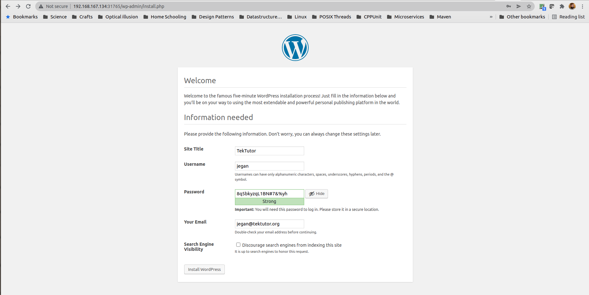

  
## Setting up a 3 Node Kubernetes Cluster using kubeadm
#### Disable Virtual Memory (swap parition) in Master and Worker Nodes
```
sudo swapoff -a
```
To permanently disable swap partition,  edit  the /etc/fstab file root user and comment the swap partition.
```
sudo vim /etc/fstab
sudo systemctl daemon-reload
```

#### Disable SELINUX in Master and Worker Nodes
``` 
setenforce 0
```

To permanently disable  SELINUX, you need to edit /etc/selinux/config file and change enforcing to disabled.
```
sudo systemctl daemon-reload
```
Configure the hostnames of master and all worker nodes
In Master Node
```
sudo hostnamectl set-hostname master
```

In worker1 Node
```
sudo hostnamectl  set-hostname worker1
```

In worker2 Node
```
sudo hostnamectl set-hostnamme worker2
```

### In the master node, type the below command to find the IP Address
```
ifconfig ens33
```
Note down the IP of master node as we need to add this in the /etc/hosts later.

### In the worker1 node, type the below command to find the IP Address
```
ifconfig ens33
```
Note down the IP of worker1 node as we need to add this in the /etc/hosts later.

### In the worker2 node, type the below command to find the IP Address
```
ifconfig ens33
```
Note down the IP of worker2 node as we need to add this in the /etc/hosts later.

### Configure /etc/hosts file
Append the IPAddresses of master, worker1 and worker2 as shown below in /etc/hosts files. This should be done in master, worker1 and worker2 nodes.
```
192.168.254.129 master 
192.168.254.130 worker1
192.168.254.131 worker2
```
The actual IP addresses might vary in your system, hence you need to replace above IP with your master, worker1 and worker2 IP addresses accordingly.

### Firewall configurations
For summary of ports that must be opened, refer official Kubernetes documention https://kubernetes.io/docs/setup/production-environment/tools/kubeadm/install-kubeadm/

#### Open the below ports in Master Node as root user
```
sudo firewall-cmd --permanent --add-port=6443/tcp
sudo firewall-cmd --permanent --add-port=2379-2380/tcp
sudo firewall-cmd --permanent --add-port=10250-10252/tcp
sudo firewall-cmd --permanent --add-port=10255/tcp
sudo firewall-cmd --permanent --add-port=30000-32767/tcp
sudo firewall-cmd --permanent --add-masquerade
sudo firewall-cmd --permanent --zone=trusted  --add-source=192.168.0.0/16 
sudo modprobe br_netfilter
sudo systemctl daemon-reload
sudo systemctl restart firewalld
sudo systemctl status firewalld
sudo firewall-cmd --list-all
```

#### Open the below ports in Worker Nodes as root user
```
sudo firewall-cmd --permanent --add-port=10250/tcp
sudo firewall-cmd --permanent --add-port=30000-32767/tcp
sudo firewall-cmd --permanent --add-masquerade
sudo firewall-cmd --permanent --zone=trusted  --add-source=192.168.0.0/16 
sudo modprobe br_netfilter
sudo systemctl daemon-reload
sudo systemctl restart firewalld
sudo systemctl status firewalld
sudo firewall-cmd --list-all
```

#### Install Docker CE in Master and Worker Nodes
```
sudo yum install -y yum-utils
sudo yum-config-manager \
    --add-repo \
    https://download.docker.com/linux/centos/docker-ce.repo
sudo yum install -y docker-ce
sudo usermod -aG docker $USER
sudo su $USER
```

### Configure Docker Engine to use systemd driver in Master and Worker Nodes

Before editing the daemon.json, let's enable and start docker so that it will create /etc/docker folder.
```
sudo systemctl enable docker
sudo systemctl start docker
```

sudo vim /etc/docker/daemon.json

```
{
  "exec-opts": ["native.cgroupdriver=systemd"],
  "log-driver": "json-file",
  "log-opts": {
     "max-size": "100m"
  },
  "storage-driver": "overlay2",
  "storage-opts": [
    "overlay2.override_kernel_check=true"
  ]
}
```

Apply the above config changes
```
sudo mkdir -p /etc/systemd/system/docker.service.d
sudo systemctl daemon-reload
sudo systemctl enable docker && sudo systemctl start docker
```

#### Configure IPTables to see bridge traffic in Master and Worker Nodes
```
cat <<EOF | sudo tee /etc/modules-load.d/k8s.conf
br_netfilter
EOF

cat <<EOF | sudo tee /etc/sysctl.d/k8s.conf
net.bridge.bridge-nf-call-ip6tables = 1
net.bridge.bridge-nf-call-iptables = 1
EOF
sudo sysctl --system
```

### Install kubectl kubeadm and kubelet on Master & Worker nodes
```
cat <<EOF | sudo tee /etc/yum.repos.d/kubernetes.repo
[kubernetes]
name=Kubernetes
baseurl=https://packages.cloud.google.com/yum/repos/kubernetes-el7-\$basearch
enabled=1
gpgcheck=1
repo_gpgcheck=1
gpgkey=https://packages.cloud.google.com/yum/doc/yum-key.gpg https://packages.cloud.google.com/yum/doc/rpm-package-key.gpg
exclude=kubelet kubeadm kubectl
EOF

sudo yum install -y kubelet kubeadm kubectl --disableexcludes=kubernetes
```

### Configure kubelet in Master and Worker Nodes
```
sudo vim /etc/sysconfig/kubelet
KUBELET_EXTRA_ARGS=--runtime-cgroups=/systemd/system.slice --kubelet-cgroups=/systemd/system.slice

```
You may enable the kubelet service as shown below
```
sudo systemctl enable --now kubelet
```

### Restart Docker and Kubelet
```
sudo systemctl daemon-reload
sudo systemctl restart docker
sudo systemctl restart kubelet
```

### Bootstrapping Master Node as root user
```
kubeadm init --pod-network-cidr=192.168.0.0/16
```

Do the below steps as rps user
```
mkdir -p $HOME/.kube
sudo cp -i /etc/kubernetes/admin.conf $HOME/.kube/config
sudo chown $(id -u):$(id -g) $HOME/.kube/config
```

If you wish to run kubectl commands as non-admin user then you need to append the below line to $HOME/.bashrc file
```
export KUBECONFIG=~/.kube/config
```
In order to apply the export changes done in $HOME/.bashrc file you need to run the below command
```
source ~/.bashrc
```

In order to access the cluster without issues after machine reboots, add the below to /root/.bashrc
Do the below as root user
```
export KUBECONFIG=/etc/kubernetes/admin.conf
```
In order to apply the export changes done in the /root/.bashrc, you need to manually run this
```
source /root/.bashrc
```

Save your join token in a file on the Master Node, the token varies on every system and every time you type kubeadm init, hence you need to save your join token for your reference befo[jegan@master ~]$ kubectl get deploy,rs,po
NAME                    READY   UP-TO-DATE   AVAILABLE   AGE
deployment.apps/nginx   1/1     1            1           33s

NAME                               DESIRED   CURRENT   READY   AGE
replicaset.apps/nginx-6888c79454   1         1         1       33s

NAME                         READY   STATUS    RESTARTS   AGE
pod/nginx-6888c79454-2cpfx   1/1     Running   0          33s
re you clear your terminal screen.
```
vim token
kubeadm join 192.168.154.128:6443 --token 5zt7tp.2txcmgnuzmxtgnl \
        --discovery-token-ca-cert-hash sha256:27758d146627cfd92079935cbaff04cb1948da37c78b2beb2fc8b15c2a5adba
```

#### In case you forgot to save your join token and cleared the terminal screen, no worries try this on Master Node
```
kubeadm token create --print-join-command
```

#### In Master Node
```
kubectl get nodes
kubectl get po -n kube-system -w
```
Press Ctrl+C to come out of watch mode.

#### Installing Calico CNI in Master Node
To learn more about Calico CNI, refer https://docs.projectcalico.org/getting-started/kubernetes/self-managed-onprem/onpremises 
```
curl https://docs.projectcalico.org/manifests/calico.yaml -O
kubectl apply -f calico.yaml
```

#### In Master Node watch the pod creation after installing Calico
```
kubectl get po -n kube-system -w
```


Press Ctrl+C to come out of watch mode.

#### In Worker Node
```
kubeadm join 192.168.154.128:6443 --token 5zt7tp.2txcmgnuzmxtgnl \
        --discovery-token-ca-cert-hash sha256:27758d146627cfd92079935cbaff04cb1948da37c78b2beb2fc8b15c2a5adba
```


#### In Master Node
At this point,  you are supposed to see 3 nodes in ready state.
```
kubectl get nodes
```


If you see similar output on your system, your 3 node Kubernetes cluster is all set !!!


#### In case you had trouble setting up master, you could reset and try init as shown below (on master and worker nodes)
```
kubeadm reset
```

You need to manually remove the below folder
```
rm -rf /etc/cni/net.d
rm -rf /etc/kubernetes
rm -rf $HOME/.kube
```

## Kubernetes Overview
- Container Orchestration Platform
- platform that manages different types of containers
- it support LXC, CRI-O(Podman), etc.,
- gives an eco-system when you are applications can be deployed with K8s cluster and make it Highly Available
- has in-built controllers that constantly monitors the health of your application, if required it repairs your application
  by replacing unhealth Pod instance of your application with an healthy Pod instance
- self-healing platform
- it supports doing rolling update i.e helps in upgrading your appliction from one version to the other without any downtime
- it helps in scaling up/down the number of instances of your microservices/applications running within K8s cluster
- kubectl is the client tools that is used majority of the times to interact with the Kubernetes cluster
- it is thru kubectl 
    - you will deploy applications
    - you will scale up/down the number of instances running within K8s cluster
    - you will perform rolling update
    - you will exposed your deployment as services either for internal or external
    - this tool is generally used in master, but can also used in workers nodes optionally
   
 - kubeadm
     - is an administrative tool
     - used to bootstrap the master
     - is also used to join the worker nodes to the K8s cluster
     - is also used to unjoin a worker node from the K8s cluster
     - is also used to reset(uninstall) K8s cluster setup
     - is available on master as well as worker nodes
    
 - kubelet
     - is the Kubernetes Container Agent that runs on every node ( master and workers)
     - this is the daemon/service that actually interacts with the Container Runtime like Docker, CRI-O, etc.,
     - kubelet is the component that pulls the required container images from Docker Hub or any of your private registries
     - kubelet also constantly monitors the health of the Pods that are running in the worker node and keeps reporting
       the status of those Pods to the master node(API Server)
     - kubelet is the one which creates the Pods on the worker node
     - kubelet is the one which creates the Control Plane components 
     
 - Control Plane components ( Typically runs on master node )
     1. API Server
     3. Scheduler
     4. Controller Managers
     5. etc ( key/value datastore )

 - API Server
      - implements all the Kubernetes features as REST API
      - is the component that all other K8s components will interact with
      - no components are allowed to talk to each other directly. i.e all communication should happen via API Server only
      - API servers store the K8s cluster status into the etcd datastore
      - API Server is the only components which will access the etcd datastore directly
      
 - Scheduler
      - scheduler is the one which identies a healthy node where your application Pods can be deployed

  - Controller Managers
      - a collection of many Controllers that are responsible for High Availability of your applications
      - Node Controller
      - Endpoint Controller
      - Deployment Controller
      - ReplicaSet Controller
      - Replication Controller
      - monitors the health of cluster as well as the application Pods and take action in case any Pods are not healthy
  
 - etcd
     - key/value pair dictionary style database
     - third-party database developed as a separate opensource project which is used by Kubernetes


## Kubernetes Jargons

Pod
  - is a Kubernetes Object
  - a group of related containers
  - your applications runs inside a container within a Pod
  - this is the smallest unit that can be deployed in a K8s cluster

ReplicaSet
  - is a Kubernetes object
  - ReplicaSet in turn manages Pod(s)
  - ReplicaSet may have one to many Pods
  - this capture the number of Pods that needs to run at any point in time
  - support scale up/down

Deployment
  - applications are in general created as a Deployment
  - Deployment in turn creates ReplicaSet(s)
  - There can one to many ReplicaSets per Deployment
  - Each version of your application there will be one ReplicaSet
  - Also supports Rolling update
  - You can initiate the Scale up/down only via Deployment
  - The Deployment internally will communicate with ReplicaSet to scale up/down the number of Pods
  - this is generally used to deploy stateless applications

DaemonSet
  - If you want to collect let's say Performance metrics from each node, then instead creating a Deployment you can create
    a DaemonSet
  - DaemonSet ensures one Pod of your application runs per node
  - As more number of nodes are added to the K8s cluster, DaemonSet will automatically create one Pod of your application on the newly joined node
  - If a node is removed from the Cluster, the DaemonSet will automatically ensure the Pod that was created by the DaemonSet is disposed

Job
 - is meant for one time activity like taking backup once in a week

StatefulSet
 - This is used to deploy stateful applications
 
Namespace
 - Helps in seggregating one pods from different deployments which belongs to different project teams within an Organization
 - if no namespace is created, then all deployments are created in the default namespace
 - all control-plane components they are created under kube-system namespace
 - in other-words there are two planes
   1. Control Plane
      - this is where Kubernetes internals components/Pods run and live
   2. Application/User Plane
      - this is where User application Pods run and live
   
Service
 - this helps access Pods via a service abstraction without knowing the specific Pod details
 - as Pods come and go i.e created when scale up happens, destroyed when scale down happens
 - it is not a good idea to connect to Pods directory
 - the recommended practice to access a group of LoadBalanced Pods via a Service
 - Service is of 2 types
   1. Internal Service
       - ClusterIP Service ( Used for database )
       - accessible only within the K8s Cluster
   2. External Service
       - accessible outside the K8s Cluster
        eg:
       - NodePort Service
       - LoadBalancer Service

## ⛹️‍♂️ Lab - Creating your first Deployment in Kubernetes
```
kubectl create deploy nginx --image=nginx:1.18
```

The expected output is
<pre>
[jegan@master ~]$ <b>kubectl create deployment nginx --image=nginx:1.18</b>
deployment.apps/nginx created
</pre>

Now let's list the deployment that we created just now
```
kubectl get deployments
kubectl get deployment
kubectl get deploy
```
The expected output is
<pre>
[jegan@master ~]$ kubectl get deploy
NAME    READY   UP-TO-DATE   AVAILABLE   AGE
nginx   0/1     1            0           6s
</pre>

Now let's list the replicaset that was created as part of deployment
```
kubectl get replicasets
kubectl get replicaset
kubectl get rs
```

The expected output is
<pre>
[jegan@master ~]$ kubectl get rs
NAME               DESIRED   CURRENT   READY   AGE
nginx-6888c79454   1         1         0       15s
</pre>

Now let's list the Pods that were created as part of the deployment
```
kubectl get pods
kubectl get pod
kubectl get po
```

The expected ouput is
<pre>
[jegan@master ~]$ kubectl get po
NAME                     READY   STATUS              RESTARTS   AGE
nginx-6888c79454-2cpfx   0/1     ContainerCreating   0          18s
</pre>

You may also list many objects at one shot
```
kubectl get deploy,rs,po
```

The expected output is
<pre>
[jegan@master ~]$ kubectl get deploy,rs,po
NAME                    READY   UP-TO-DATE   AVAILABLE   AGE
deployment.apps/nginx   1/1     1            1           33s

NAME                               DESIRED   CURRENT   READY   AGE
replicaset.apps/nginx-6888c79454   1         1         1       33s

NAME                         READY   STATUS    RESTARTS   AGE
pod/nginx-6888c79454-2cpfx   1/1     Running   0          33s
</pre>

## What internally happens in K8s cluster when we create a deployment?

When you create a new deployment like so
```
kubectl create deployment nginx --image=nginx:1.18
```

1. kubectl sends a REST request to API Server to create a deployment with name "nginx" using image=nginx:1.18
2. API Server then creates a Deployment object and stores the Deployment in etcd datastore
3. As soon as a new Deployment is created, API Server sends an event something like "New Deployment Created"
4. The Deployment Controller receives this event and then grabs the details from the event which then sends a REST API request to API Server
   to create a ReplicaSet.
5. The API Server creates a ReplicaSet object and stores that object in etcd datastore
6. This triggers "New ReplicaSet Created" kind of event.
7. ReplicaSet Controller will receive this event and then looks for how many replicas of Pod needs to created.
8. ReplicaSet Contoller will make some REST API request to API Server to create so many Pods
9. API Server then creates the requested number of Pod objects and stores it in the etcd datastore
10. This triggers "New Pod Created" kind of event.
11. The Scheduler receives this event, and then it identifies healthy nodes where these Pods can be deployed and intimates this to API Server
    by making a REST call.
12. API Server will get the node recommended suggested by Scheduler and it then updates the Pod definition stored in the etcd datastore.
13. This triggers another event.
14. This event is then received by kubelet agent running on those respective worker nodes.
15. The kubelet agent then looks for the Container image in the local registry, if it is missing then it pulls the required container image in order to create the containers that needs to run inside the Pod.
16. Kubelet constantly monitors the status and health of the Pod it created and reports it to API Server like heart-beat event update
17. Any update from kubelet is received by API Server, and API Server keeps the respective Pod definitions stored in the etcd datastore updated.


## ⛹️‍ Lab - Finding more details about a master node
```
kubectl describe node/master.tektutor.org
```

The expected output is
<pre>
[jegan@master devops-march-2022]$ <b>kubectl describe node/master.tektutor.org</b>
Name:               master.tektutor.org
Roles:              control-plane,master
Labels:             beta.kubernetes.io/arch=amd64
                    beta.kubernetes.io/os=linux
                    kubernetes.io/arch=amd64
                    kubernetes.io/hostname=master.tektutor.org
                    kubernetes.io/os=linux
                    node-role.kubernetes.io/control-plane=
                    node-role.kubernetes.io/master=
                    node.kubernetes.io/exclude-from-external-load-balancers=
Annotations:        kubeadm.alpha.kubernetes.io/cri-socket: /var/run/dockershim.sock
                    node.alpha.kubernetes.io/ttl: 0
                    projectcalico.org/IPv4Address: 192.168.167.134/24
                    projectcalico.org/IPv4IPIPTunnelAddr: 192.168.63.64
                    volumes.kubernetes.io/controller-managed-attach-detach: true
CreationTimestamp:  Mon, 07 Mar 2022 20:45:51 -0800
Taints:             node-role.kubernetes.io/master:NoSchedule
Unschedulable:      false
Lease:
  HolderIdentity:  master.tektutor.org
  AcquireTime:     <unset>
  RenewTime:       Mon, 07 Mar 2022 23:27:14 -0800
Conditions:
  Type                 Status  LastHeartbeatTime                 LastTransitionTime                Reason                       Message
  ----                 ------  -----------------                 ------------------                ------                       -------
  NetworkUnavailable   False   Mon, 07 Mar 2022 21:01:07 -0800   Mon, 07 Mar 2022 21:01:07 -0800   CalicoIsUp                   Calico is running on this node
  MemoryPressure       False   Mon, 07 Mar 2022 23:25:23 -0800   Mon, 07 Mar 2022 20:45:48 -0800   KubeletHasSufficientMemory   kubelet has sufficient memory available
  DiskPressure         False   Mon, 07 Mar 2022 23:25:23 -0800   Mon, 07 Mar 2022 20:45:48 -0800   KubeletHasNoDiskPressure     kubelet has no disk pressure
  PIDPressure          False   Mon, 07 Mar 2022 23:25:23 -0800   Mon, 07 Mar 2022 20:45:48 -0800   KubeletHasSufficientPID      kubelet has sufficient PID available
  Ready                True    Mon, 07 Mar 2022 23:25:23 -0800   Mon, 07 Mar 2022 21:00:37 -0800   KubeletReady                 kubelet is posting ready status
Addresses:
  InternalIP:  192.168.167.134
  Hostname:    master.tektutor.org
Capacity:
  cpu:                8
  ephemeral-storage:  192796696Ki
  hugepages-1Gi:      0
  hugepages-2Mi:      0
  memory:             32761636Ki
  pods:               110
Allocatable:
  cpu:                8
  ephemeral-storage:  177681434740
  hugepages-1Gi:      0
  hugepages-2Mi:      0
  memory:             32659236Ki
  pods:               110
System Info:
  Machine ID:                 00ebb070c9e0453c9df21160c377f1ac
  System UUID:                97024D56-6FBE-2847-1627-F1B170DED4ED
  Boot ID:                    90390758-3a29-4d7a-be8a-a6b5e16112fd
  Kernel Version:             3.10.0-1160.el7.x86_64
  OS Image:                   CentOS Linux 7 (Core)
  Operating System:           linux
  Architecture:               amd64
  Container Runtime Version:  docker://20.10.12
  Kubelet Version:            v1.23.4
  Kube-Proxy Version:         v1.23.4
PodCIDR:                      192.168.0.0/24
PodCIDRs:                     192.168.0.0/24
Non-terminated Pods:          (9 in total)
  Namespace                   Name                                           CPU Requests  CPU Limits  Memory Requests  Memory Limits  Age
  ---------                   ----                                           ------------  ----------  ---------------  -------------  ---
  kube-system                 calico-kube-controllers-56fcbf9d6b-gxzzv       0 (0%)        0 (0%)      0 (0%)           0 (0%)         147m
  kube-system                 calico-node-hv5w5                              250m (3%)     0 (0%)      0 (0%)           0 (0%)         147m
  kube-system                 coredns-64897985d-9h5tz                        100m (1%)     0 (0%)      70Mi (0%)        170Mi (0%)     161m
  kube-system                 coredns-64897985d-q7kj4                        100m (1%)     0 (0%)      70Mi (0%)        170Mi (0%)     161m
  kube-system                 etcd-master.tektutor.org                       100m (1%)     0 (0%)      100Mi (0%)       0 (0%)         161m
  kube-system                 kube-apiserver-master.tektutor.org             250m (3%)     0 (0%)      0 (0%)           0 (0%)         161m
  kube-system                 kube-controller-manager-master.tektutor.org    200m (2%)     0 (0%)      0 (0%)           0 (0%)         161m
  kube-system                 kube-proxy-5xq4m                               0 (0%)        0 (0%)      0 (0%)           0 (0%)         161m
  kube-system                 kube-scheduler-master.tektutor.org             100m (1%)     0 (0%)      0 (0%)           0 (0%)         161m
Allocated resources:
  (Total limits may be over 100 percent, i.e., overcommitted.)
  Resource           Requests     Limits
  --------           --------     ------
  cpu                1100m (13%)  0 (0%)
  memory             240Mi (0%)   340Mi (1%)
  ephemeral-storage  0 (0%)       0 (0%)
  hugepages-1Gi      0 (0%)       0 (0%)
  hugepages-2Mi      0 (0%)       0 (0%)
Events:              <none>

</pre>


## ⛹️‍♀️ Lab - Finding more details about a worker1 node
```
kubectl describe node/worker1.tektutor.org
```

The expected output is
<pre>
[jegan@master devops-march-2022]$ <b>kubectl describe node/worker1.tektutor.org</b>
Name:               worker1.tektutor.org
Roles:              <none>
Labels:             beta.kubernetes.io/arch=amd64
                    beta.kubernetes.io/os=linux
                    kubernetes.io/arch=amd64
                    kubernetes.io/hostname=worker1.tektutor.org
                    kubernetes.io/os=linux
Annotations:        kubeadm.alpha.kubernetes.io/cri-socket: /var/run/dockershim.sock
                    node.alpha.kubernetes.io/ttl: 0
                    projectcalico.org/IPv4Address: 192.168.167.135/24
                    projectcalico.org/IPv4IPIPTunnelAddr: 192.168.145.192
                    volumes.kubernetes.io/controller-managed-attach-detach: true
CreationTimestamp:  Mon, 07 Mar 2022 21:09:21 -0800
Taints:             <none>
Unschedulable:      false
Lease:
  HolderIdentity:  worker1.tektutor.org
  AcquireTime:     <unset>
  RenewTime:       Mon, 07 Mar 2022 23:29:37 -0800
Conditions:
  Type                 Status  LastHeartbeatTime                 LastTransitionTime                Reason                       Message
  ----                 ------  -----------------                 ------------------                ------                       -------
  NetworkUnavailable   False   Mon, 07 Mar 2022 21:10:40 -0800   Mon, 07 Mar 2022 21:10:40 -0800   CalicoIsUp                   Calico is running on this node
  MemoryPressure       False   Mon, 07 Mar 2022 23:26:23 -0800   Mon, 07 Mar 2022 21:09:21 -0800   KubeletHasSufficientMemory   kubelet has sufficient memory available
  DiskPressure         False   Mon, 07 Mar 2022 23:26:23 -0800   Mon, 07 Mar 2022 21:09:21 -0800   KubeletHasNoDiskPressure     kubelet has no disk pressure
  PIDPressure          False   Mon, 07 Mar 2022 23:26:23 -0800   Mon, 07 Mar 2022 21:09:21 -0800   KubeletHasSufficientPID      kubelet has sufficient PID available
  Ready                True    Mon, 07 Mar 2022 23:26:23 -0800   Mon, 07 Mar 2022 21:10:13 -0800   KubeletReady                 kubelet is posting ready status
Addresses:
  InternalIP:  192.168.167.135
  Hostname:    worker1.tektutor.org
Capacity:
  cpu:                8
  ephemeral-storage:  192796696Ki
  hugepages-1Gi:      0
  hugepages-2Mi:      0
  memory:             32761636Ki
  pods:               110
Allocatable:
  cpu:                8
  ephemeral-storage:  177681434740
  hugepages-1Gi:      0
  hugepages-2Mi:      0
  memory:             32659236Ki
  pods:               110
System Info:
  Machine ID:                 00ebb070c9e0453c9df21160c377f1ac
  System UUID:                C22E4D56-9C9E-196B-1FC8-729075838DC8
  Boot ID:                    0b73fb22-8c21-41c8-9fee-f5e18115cd21
  Kernel Version:             3.10.0-1160.el7.x86_64
  OS Image:                   CentOS Linux 7 (Core)
  Operating System:           linux
  Architecture:               amd64
  Container Runtime Version:  docker://20.10.12
  Kubelet Version:            v1.23.4
  Kube-Proxy Version:         v1.23.4
PodCIDR:                      192.168.1.0/24
PodCIDRs:                     192.168.1.0/24
Non-terminated Pods:          (3 in total)
  Namespace                   Name                      CPU Requests  CPU Limits  Memory Requests  Memory Limits  Age
  ---------                   ----                      ------------  ----------  ---------------  -------------  ---
  default                     nginx-6888c79454-2cpfx    0 (0%)        0 (0%)      0 (0%)           0 (0%)         44m
  kube-system                 calico-node-bwztt         250m (3%)     0 (0%)      0 (0%)           0 (0%)         140m
  kube-system                 kube-proxy-5nfzf          0 (0%)        0 (0%)      0 (0%)           0 (0%)         140m
Allocated resources:
  (Total limits may be over 100 percent, i.e., overcommitted.)
  Resource           Requests   Limits
  --------           --------   ------
  cpu                250m (3%)  0 (0%)
  memory             0 (0%)     0 (0%)
  ephemeral-storage  0 (0%)     0 (0%)
  hugepages-1Gi      0 (0%)     0 (0%)
  hugepages-2Mi      0 (0%)     0 (0%)
Events:              <none>
[jegan@master devops-march-2022]$ kubectl describe node/worker2.tektutor.org
Name:               worker2.tektutor.org
Roles:              <none>
Labels:             beta.kubernetes.io/arch=amd64
                    beta.kubernetes.io/os=linux
                    kubernetes.io/arch=amd64
                    kubernetes.io/hostname=worker2.tektutor.org
                    kubernetes.io/os=linux
Annotations:        kubeadm.alpha.kubernetes.io/cri-socket: /var/run/dockershim.sock
                    node.alpha.kubernetes.io/ttl: 0
                    projectcalico.org/IPv4Address: 192.168.167.136/24
                    projectcalico.org/IPv4IPIPTunnelAddr: 192.168.72.128
                    volumes.kubernetes.io/controller-managed-attach-detach: true
CreationTimestamp:  Mon, 07 Mar 2022 21:12:12 -0800
Taints:             <none>
Unschedulable:      false
Lease:
  HolderIdentity:  worker2.tektutor.org
  AcquireTime:     <unset>
  RenewTime:       Mon, 07 Mar 2022 23:30:28 -0800
Conditions:
  Type                 Status  LastHeartbeatTime                 LastTransitionTime                Reason                       Message
  ----                 ------  -----------------                 ------------------                ------                       -------
  NetworkUnavailable   False   Mon, 07 Mar 2022 21:13:32 -0800   Mon, 07 Mar 2022 21:13:32 -0800   CalicoIsUp                   Calico is running on this node
  MemoryPressure       False   Mon, 07 Mar 2022 23:26:56 -0800   Mon, 07 Mar 2022 21:12:12 -0800   KubeletHasSufficientMemory   kubelet has sufficient memory available
  DiskPressure         False   Mon, 07 Mar 2022 23:26:56 -0800   Mon, 07 Mar 2022 21:12:12 -0800   KubeletHasNoDiskPressure     kubelet has no disk pressure
  PIDPressure          False   Mon, 07 Mar 2022 23:26:56 -0800   Mon, 07 Mar 2022 21:12:12 -0800   KubeletHasSufficientPID      kubelet has sufficient PID available
  Ready                True    Mon, 07 Mar 2022 23:26:56 -0800   Mon, 07 Mar 2022 21:13:04 -0800   KubeletReady                 kubelet is posting ready status
Addresses:
  InternalIP:  192.168.167.136
  Hostname:    worker2.tektutor.org
Capacity:
  cpu:                8
  ephemeral-storage:  192796696Ki
  hugepages-1Gi:      0
  hugepages-2Mi:      0
  memory:             32761636Ki
  pods:               110
Allocatable:
  cpu:                8
  ephemeral-storage:  177681434740
  hugepages-1Gi:      0
  hugepages-2Mi:      0
  memory:             32659236Ki
  pods:               110
System Info:
  Machine ID:                 00ebb070c9e0453c9df21160c377f1ac
  System UUID:                9CAE4D56-D414-C40C-8AFC-E9D1CDC57C1C
  Boot ID:                    b7d1e22d-ee9a-485b-aafc-36b7ca729fad
  Kernel Version:             3.10.0-1160.el7.x86_64
  OS Image:                   CentOS Linux 7 (Core)
  Operating System:           linux
  Architecture:               amd64
  Container Runtime Version:  docker://20.10.12
  Kubelet Version:            v1.23.4
  Kube-Proxy Version:         v1.23.4
PodCIDR:                      192.168.2.0/24
PodCIDRs:                     192.168.2.0/24
Non-terminated Pods:          (2 in total)
  Namespace                   Name                 CPU Requests  CPU Limits  Memory Requests  Memory Limits  Age
  ---------                   ----                 ------------  ----------  ---------------  -------------  ---
  kube-system                 calico-node-vhf28    250m (3%)     0 (0%)      0 (0%)           0 (0%)         138m
  kube-system                 kube-proxy-sprqs     0 (0%)        0 (0%)      0 (0%)           0 (0%)         138m
Allocated resources:
  (Total limits may be over 100 percent, i.e., overcommitted.)
  Resource           Requests   Limits
  --------           --------   ------
  cpu                250m (3%)  0 (0%)
  memory             0 (0%)     0 (0%)
  ephemeral-storage  0 (0%)     0 (0%)
  hugepages-1Gi      0 (0%)     0 (0%)
  hugepages-2Mi      0 (0%)     0 (0%)
Events:              <none>
</pre>

## ⛹️‍♂️ Lab - Listing nodes in wide mode
```
kubectl get nodes -o wide
```

The expected output is
<pre>
[jegan@master devops-march-2022]$ kubectl <b>get nodes -o wide</b>
NAME                   STATUS   ROLES                  AGE    VERSION   INTERNAL-IP       EXTERNAL-IP   OS-IMAGE                KERNEL-VERSION           CONTAINER-RUNTIME
master.tektutor.org    Ready    control-plane,master   169m   v1.23.4   192.168.167.134   <none>        CentOS Linux 7 (Core)   3.10.0-1160.el7.x86_64   docker://20.10.12
worker1.tektutor.org   Ready    <none>                 146m   v1.23.4   192.168.167.135   <none>        CentOS Linux 7 (Core)   3.10.0-1160.el7.x86_64   docker://20.10.12
worker2.tektutor.org   Ready    <none>                 143m   v1.23.4   192.168.167.136   <none>        CentOS Linux 7 (Core)   3.10.0-1160.el7.x86_64   docker://20.10.12
[jegan@master devops-march-2022]$ 
</pre>

## Scaling up a nginx deployment to create more Pod instances
```
kubectl scale deploy/nginx --replicas=6
kubectl get po -w
kubectl get po
```
To come out of the watch mode, you need press Ctrl + C.


The expected output is
<pre>
[jegan@master devops-march-2022]$ <b>kubectl scale deploy/nginx --replicas=6</b>
deployment.apps/nginx scaled
[jegan@master devops-march-2022]$ <b>kubectl get po -w</b>
NAME                     READY   STATUS              RESTARTS   AGE
nginx-6888c79454-2cpfx   1/1     Running             0          52m
nginx-6888c79454-8gf8b   0/1     ContainerCreating   0          2s
nginx-6888c79454-bs6zb   0/1     ContainerCreating   0          2s
nginx-6888c79454-dcqqd   0/1     ContainerCreating   0          2s
nginx-6888c79454-qqhhw   1/1     Running             0          2s
nginx-6888c79454-v4t4w   1/1     Running             0          2s
nginx-6888c79454-dcqqd   0/1     ContainerCreating   0          3s
nginx-6888c79454-bs6zb   0/1     ContainerCreating   0          3s
nginx-6888c79454-8gf8b   0/1     ContainerCreating   0          3s
nginx-6888c79454-dcqqd   1/1     Running             0          23s
nginx-6888c79454-bs6zb   1/1     Running             0          27s
nginx-6888c79454-8gf8b   1/1     Running             0          31s
^C[jegan@master devops-march-2022]$ <b>kubectl get po</b>
NAME                     READY   STATUS    RESTARTS   AGE
nginx-6888c79454-2cpfx   1/1     Running   0          52m
nginx-6888c79454-8gf8b   1/1     Running   0          35s
nginx-6888c79454-bs6zb   1/1     Running   0          35s
nginx-6888c79454-dcqqd   1/1     Running   0          35s
nginx-6888c79454-qqhhw   1/1     Running   0          35s
nginx-6888c79454-v4t4w   1/1     Running   0          35s
</pre>

## ⛹️‍♂️ Lab - Scaling down nginx deployment
```
kubectl scale deploy/nginx --replicas=3
```

The expected output is
<pre>
[jegan@master devops-march-2022]$ <b>kubectl scale deploy/nginx --replicas=3</b>
deployment.apps/nginx scaled
</pre>

## ⛹️‍♀️ Lab - Understanding use of labels in Kubernetes

List all labels associated with deployments
```
kubectl get deploy --show-labels
```

List all labels associated with replicasets
```
kubectl get rs --show-lables
```

List all labels associated with pods
```
kubectl get po --show-labels
```

Listing pods that has a particular label matching a particular value
```
kubectl get po -l app=nginx
```
The expected output is
<pre>
[jegan@master devops-march-2022]$ <b>kubectl get po -l app=nginx</b>
NAME                     READY   STATUS    RESTARTS   AGE
nginx-6888c79454-2cpfx   1/1     Running   0          120m
nginx-6888c79454-8gf8b   1/1     Running   0          68m
nginx-6888c79454-8w95h   1/1     Running   0          60m
nginx-6888c79454-dcqqd   1/1     Running   0          68m
nginx-6888c79454-rgg8k   1/1     Running   0          60m
nginx-6888c79454-zmrd8   1/1     Running   0          60m
</pre>
The number of pods listed might vary in your system. 


Listing pods that has a label app=hello
```
kubectl get po -l app=hello
```

The expected output is
<pre>
[jegan@master devops-march-2022]$ <b>kubectl get rs -l app=hello</b>
NAME               DESIRED   CURRENT   READY   AGE
hello-66dc74bd76   1         1         1       100s
</pre>


## ⛹️‍♂️ Lab - Multi Pod application that also demonstrates Persistent Volume
```
cd /home/user
git clone https://github.com/tektutor/devops-march-2022.git
cd devops-march-2022
git pull
cd Day2/manifests/wordpress

kubectl apply -f mysql-persistent-vol.yml
kubectl apply -f mysql-persistent-vol-claim.yml
kubectl apply -f mysql-deploy.yml
kubectl apply -f mysql-service.yml

kubectl apply -f wordpress-deploy.yml
kubectl apply -f wordpress-service.yml
```

Now check if the persistent volume claim is bound with the persistent volume
```
kubectl get pv,pvc
```
The expected output is
<pre>
[jegan@master wordpress]$ <b>kubectl get pv,pvc</b>
NAME                               CAPACITY   ACCESS MODES   RECLAIM POLICY   STATUS   CLAIM                    STORAGECLASS   REASON   AGE
persistentvolume/mysql-pv-volume   1Gi        RWX            Retain           Bound    default/mysql-pv-claim   manual                  49m

NAME                                   STATUS   VOLUME            CAPACITY   ACCESS MODES   STORAGECLASS   AGE
persistentvolumeclaim/mysql-pv-claim   Bound    mysql-pv-volume   1Gi        RWX            manual         49m

</pre>

Now check if wordpress and mysql Pods are running
```
kubectl get po
```
The expected output is
<pre>
[jegan@master wordpress]$ <b>kubectl get po</b>
NAME                         READY   STATUS    RESTARTS   AGE</b>
mysql-84b659854b-ccrpp       1/1     Running   0          49m
wordpress-7d5bc6876b-j8xqc   1/1     Running   0          16m
</pre>

Now check if the wordpress and mysql services are created
```
kubectl get svc
```
The expected output is
<pre>
[jegan@master wordpress]$ <b>kubectl get svc</b>
NAME                TYPE        CLUSTER-IP      EXTERNAL-IP   PORT(S)        AGE
kubernetes          ClusterIP   10.96.0.1       <none>        443/TCP        6h57m
<b>mysql-service       ClusterIP   10.109.113.3    <none>        3306/TCP       45m
wordpress-service   NodePort    10.104.149.87   <none>        80:31765/TCP   42m</b>
</pre>

Now you can try accessing the wordpress web page from any web browser either within the CentOS Lab machine or from the Windows Lab machine web browser
```
http://master-node-ip
http://worker1-node-ip
http://worker2-node-ip
```

You will be presented with page similar to screenshot below

