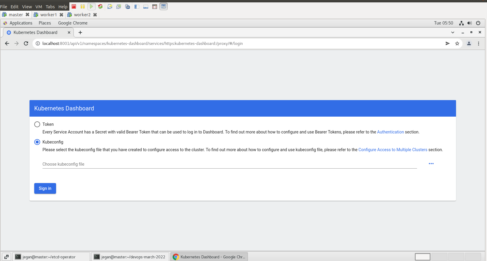
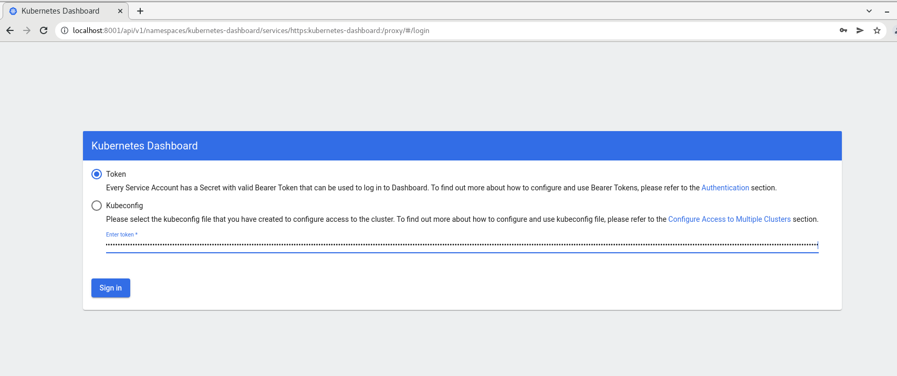
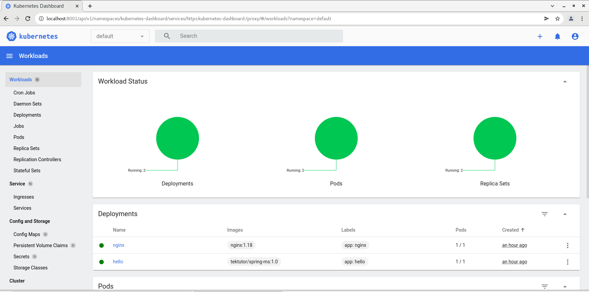
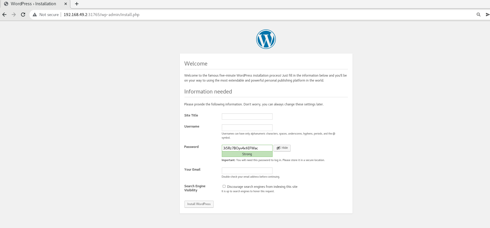
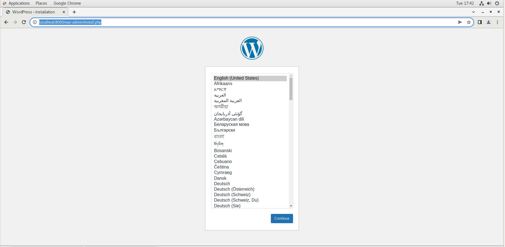

## ⛹️‍♀️ Lab - Creating Kubernetes Dashboard
```
kubectl apply -f https://raw.githubusercontent.com/kubernetes/dashboard/v2.5.0/aio/deploy/recommended.yaml
```

The expected output is
<pre>
[jegan@master etcd-operator]$ <b>kubectl apply -f https://raw.githubusercontent.com/kubernetes/dashboard/v2.5.0/aio/deploy/recommended.yaml</b>
namespace/kubernetes-dashboard created
serviceaccount/kubernetes-dashboard created
service/kubernetes-dashboard created
secret/kubernetes-dashboard-certs created
secret/kubernetes-dashboard-csrf created
secret/kubernetes-dashboard-key-holder created
configmap/kubernetes-dashboard-settings created
role.rbac.authorization.k8s.io/kubernetes-dashboard created
clusterrole.rbac.authorization.k8s.io/kubernetes-dashboard created
rolebinding.rbac.authorization.k8s.io/kubernetes-dashboard created
clusterrolebinding.rbac.authorization.k8s.io/kubernetes-dashboard created
deployment.apps/kubernetes-dashboard created
service/dashboard-metrics-scraper created
deployment.apps/dashboard-metrics-scraper created
</pre>

#### Creating an user to access Kubernetes Dashboard
```
cd ~/devops-march-2022
git pull
cd Day3/k8s-dashboard

kubectl apply -f service-ac.yml
kubectl apply -f cluster-role-binding.yml
```
The expected output is

<pre>
jegan@master k8s-dashboard]$ ls
cluster-role-binding.yml  service-ac.yml
[jegan@master k8s-dashboard]$ pwd
/home/jegan/devops-march-2022/Day3/k8s-dashboard
[jegan@master k8s-dashboard]$ <b>kubectl apply -f service-ac.yml</b>
serviceaccount/admin-user created
[jegan@master k8s-dashboard]$ <b>kubectl apply -f cluster-role-binding.yml</b>
clusterrolebinding.rbac.authorization.k8s.io/admin-user created
</pre>

#### Port-forward to access the Dashboard URL
```
kubectl proxy
```

The expected output is

<pre>
[jegan@master etcd-operator]$ <b>kubectl proxy</b>
Starting to serve on 127.0.0.1:8001
</pre>

#### Create a bearer token to login 
```
kubectl -n kubernetes-dashboard get secret $(kubectl -n kubernetes-dashboard get sa/admin-user -o jsonpath="{.secrets[0].name}") -o go-template="{{.data.token | base64decode}}"
```

The expected output is
<pre>
[jegan@master.tektutor.org k8s-dashboard]$ kubectl -n kubernetes-dashboard get secret $(kubectl -n kubernetes-dashboard get sa/admin-user -o jsonpath="{.secrets[0].name}") -o go-template="{{.data.token | base64decode}}"
eyJhbGciOiJSUzI1NiIsImtpZCI6Ikt6elV0ZkU4TmNQX2hTRF9aemdFREdlemNzZWJrNGc1NmlvajEtUmhleWMifQ.eyJpc3MiOiJrdWJlcm5ldGVzL3NlcnZpY2VhY2NvdW50Iiwia3ViZXJuZXRlcy5pby9zZXJ2aWNlYWNjb3VudC9uYW1lc3BhY2UiOiJrdWJlcm5ldGVzLWRhc2hib2FyZCIsImt1YmVybmV0ZXMuaW8vc2VydmljZWFjY291bnQvc2VjcmV0Lm5hbWUiOiJhZG1pbi11c2VyLXRva2VuLTVzaGM0Iiwia3ViZXJuZXRlcy5pby9zZXJ2aWNlYWNjb3VudC9zZXJ2aWNlLWFjY291bnQubmFtZSI6ImFkbWluLXVzZXIiLCJrdWJlcm5ldGVzLmlvL3NlcnZpY2VhY2NvdW50L3NlcnZpY2UtYWNjb3VudC51aWQiOiI1ZDI2MmQ4Ni00ZTVhLTQyNzEtYTI1Yi1lYzVjZDhhNzIwNWYiLCJzdWIiOiJzeXN0ZW06c2VydmljZWFjY291bnQ6a3ViZXJuZXRlcy1kYXNoYm9hcmQ6YWRtaW4tdXNlciJ9.DxK3ckF6eGy_cZr6uPHY8JC0e8S-11TUxSGixUBGeTBTfD2fm05MhFqaPFZ45SzuWQjTyna9ytIwxKB0gKBo06LwX4paYd1kcOH6fjgB0sxLLobn8hN6eNEnrCMbQjeMTwuqjx-HGftJLxjrulksoNaMdwu6cEMzK0NSOt3XgmnTWEv4kbdeGwLAC0zO8UV2uOG-shxV7I0BETWxF49cGCgRGB_4wtjWU44a6TTmY84ONn535Toumo_KL4e-SaXE2WTsmOmSeMrmXZdTUIEZCt3z3CDT-LfRxR-ZiAq9Q8_W-gIcXplqSp8ww5KCkOgjbhJRk6RCWlYUZinZtb_Z5g[jegan@master k8s-dashboard]$ 
</pre>

#### Launching your Kubernetes Dashboard from Google Chrome browser
```
http://localhost:8001/api/v1/namespaces/kubernetes-dashboard/services/https:kubernetes-dashboard:/proxy/#/login
```

You will get a page like shown in the screenshot below


Now copy and paste the bearer token to login as shown in the screenshot below


If all went butter smooth, you will get a similar page as shown below


## ⛹️‍♂️ Lab - Understanding the use of Config Maps in K8s applications
```
cd ~/devops-march-2022
git pull
cd Day3/configmaps
kubectl apply -f configmap.yml
kubectl apply -f python-rest-dep.yml
```
The expected output is
<pre>
[jegan@master.tektutor.org configmaps]$ kubectl apply -f python-rest-dep.yml 
service/hello-ms unchanged
deployment.apps/hello-ms created
[jegan@master.tektutor.org configmaps]$ kubectl get deploy,rs,po,svc
NAME                       READY   UP-TO-DATE   AVAILABLE   AGE
deployment.apps/hello-ms   0/2     2            0           16s

NAME                                  DESIRED   CURRENT   READY   AGE
replicaset.apps/hello-ms-8689d768fc   2         2         0       16s

NAME                            READY   STATUS              RESTARTS   AGE
pod/hello-ms-8689d768fc-4cfzj   0/1     ContainerCreating   0          15s
pod/hello-ms-8689d768fc-v852x   0/1     ContainerCreating   0          15s
pod/mycluster-0                 0/2     Pending             0          11h

NAME                 TYPE        CLUSTER-IP      EXTERNAL-IP   PORT(S)        AGE
service/hello-ms     NodePort    10.108.133.62   <none>        80:31500/TCP   65s
service/kubernetes   ClusterIP   10.96.0.1       <none>        443/TCP        24h
[jegan@master.tektutor.org configmaps]$ kubectl get deploy,rs,po,svc
NAME                       READY   UP-TO-DATE   AVAILABLE   AGE
deployment.apps/hello-ms   0/2     2            0           25s

NAME                                  DESIRED   CURRENT   READY   AGE
replicaset.apps/hello-ms-8689d768fc   2         2         0       25s

NAME                            READY   STATUS              RESTARTS   AGE
pod/hello-ms-8689d768fc-4cfzj   0/1     ContainerCreating   0          24s
pod/hello-ms-8689d768fc-v852x   0/1     ContainerCreating   0          24s
pod/mycluster-0                 0/2     Pending             0          11h

NAME                 TYPE        CLUSTER-IP      EXTERNAL-IP   PORT(S)        AGE
service/hello-ms     NodePort    10.108.133.62   <none>        80:31500/TCP   74s
service/kubernetes   ClusterIP   10.96.0.1       <none>        443/TCP        24h
[jegan@master.tektutor.org configmaps]$ kubectl get po -w
NAME                        READY   STATUS              RESTARTS   AGE
hello-ms-8689d768fc-4cfzj   0/1     ContainerCreating   0          29s
hello-ms-8689d768fc-v852x   0/1     ContainerCreating   0          29s
mycluster-0                 0/2     Pending             0          11h
hello-ms-8689d768fc-4cfzj   1/1     Running             0          34s
hello-ms-8689d768fc-v852x   1/1     Running             0          34s
^C[jegan@master.tektutor.org configmaps]$ kubectl get po 
NAME                        READY   STATUS    RESTARTS   AGE
hello-ms-8689d768fc-4cfzj   1/1     Running   0          38s
hello-ms-8689d768fc-v852x   1/1     Running   0          38s
mycluster-0                 0/2     Pending   0          11h
[jegan@master.tektutor.org configmaps]$ kubectl get svc
NAME         TYPE        CLUSTER-IP      EXTERNAL-IP   PORT(S)        AGE
hello-ms     NodePort    10.108.133.62   <none>        80:31500/TCP   94s
kubernetes   ClusterIP   10.96.0.1       <none>        443/TCP        24h
[jegan@master configmaps]$ kubectl describe svc/hello-ms
Name:                     hello-ms
Namespace:                default
Labels:                   app=hello-ms
Annotations:              <none>
Selector:                 app=hello-ms
Type:                     NodePort
IP Family Policy:         SingleStack
IP Families:              IPv4
IP:                       10.108.133.62
IPs:                      10.108.133.62
Port:                     <unset>  80/TCP
TargetPort:               80/TCP
NodePort:                 <unset>  31500/TCP
Endpoints:                192.168.145.230:80,192.168.72.166:80
Session Affinity:         None
External Traffic Policy:  Cluster
Events:                   <none>
[jegan@master.tektutor.org configmaps]$ cat /etc/hosts
127.0.0.1   localhost localhost.localdomain localhost4 localhost4.localdomain4
::1         localhost localhost.localdomain localhost6 localhost6.localdomain6
192.168.167.134 master.tektutor.org
192.168.167.135 worker1.tektutor.org
192.168.167.136 worker2.tektutor.org
[jegan@master.tektutor.org configmaps]$ curl http://master.tektutor.org:31500/hello
Hello Kubernetes! /usr/lib/java/jdk1.8 /usr/share/maven hello
</pre>

## ⛹️‍♂️ Lab - Understanding the use of secrets in K8s applications
```
cd ~/devops-march-2022
git pull
cd Day3/secrets

kubectl apply -f my-secret.yml
```

The expected output is
<pre>
[jegan@master.tektutor.org secrets]$ <b>kubectl apply -f my-secret.yml</b>
secret/mysecret created
</pre>

Now let's create the application Pod that fetches the secret data
```
kubectl apply -f another-pod.yml
```
The expected output is
<pre>
[jegan@master.tektutor.org secrets]$ <b>kubectl apply -f another-pod.yml</b>
pod/another-pod created
</pre>

Now let's list the po
```
kubectl get po 
```
The expected output is
<pre>
[jegan@master.tektutor.org secrets]$ <b>kubectl get po</b>
NAME                        READY   STATUS              RESTARTS   AGE
<b>another-pod                 1/1     Running             0          5m36s</b>
hello-ms-8689d768fc-4cfzj   1/1     Running             0          41m
hello-ms-8689d768fc-v852x   1/1     Running             0          41m
</pre>

Get inside the Pod shell to inspect the secret values

The expected output is
<pre>
[jegan@master.tektutor.org secrets]$ <b>kubectl exec -it my-secret-pod sh</b>
kubectl exec [POD] [COMMAND] is DEPRECATED and will be removed in a future version. Use kubectl exec [POD] -- [COMMAND] instead.
/ # echo $SECRET_USERNAME
<b>admin</b>
/ # echo $SECRET_PASSWORD
<b>my-secret-password</b>
/ # exit
</pre>

## ⛹️‍♀️ Lab - Installing Helm Kubernetes package manager
```
curl -fsSL -o get_helm.sh https://raw.githubusercontent.com/helm/helm/main/scripts/get-helm-3
chmod 700 get_helm.sh
./get_helm.sh
```

## ℹ️ Kubernetes Operators Hub
This portal has many open source ready made Kubernetes Operators that can be installed into your Kubernetes Cluster.
```
https://operatorhub.io/
```
## ⛹️‍♂️ Lab - Create our own custom Helm Chart package for wordpress application and deploy into K8s cluster
```
cd ~/devops-march-2022
git pull

cd Day3/helm/wordpress
helm package wordpress
```

The expected output is
<pre>
[jegan@tektutor.org helm]$ <b>helm package wordpress</b>
Successfully packaged chart and saved it to: /home/jegan/devops-march-2022/Day3/helm/wordpress-0.1.0.tgz
[jegan@minikube.tektutor.org helm]$ ls
wordpress  <b>wordpress-0.1.0.tgz</b>
</pre>

It's time to install our custom wordpress helm chart into K8s cluster
```
helm install wordpress wordpress-0.1.0.tgz
```
The expected output is
<pre>
[jegan@minikube.tektutor.org helm]$ helm install wordpress wordpress-0.1.0.tgz 
NAME: wordpress
LAST DEPLOYED: Tue Mar  8 22:56:17 2022
NAMESPACE: default
STATUS: deployed
REVISION: 1
TEST SUITE: None
</pre>

You can list the helm packages installed into K8s cluster as shown below
```
[jegan@minikube.tektutor.org helm]$ helm list
NAME     	NAMESPACE	REVISION	UPDATED                                	STATUS  	CHART          	APP VERSION
wordpress	default  	1       	2022-03-08 22:56:17.470900864 -0800 PST	deployed	wordpress-0.1.0	1.16.0     
```

You can now see the deploy,service,pods and its persistent volume and claim
```
kubectl get deploy,svc,po
```

The expected output is
<pre>
[jegan@minikube.tektutor.org helm]$ kubectl get pv,pvc,deploy,svc,po
NAME                                                        CAPACITY   ACCESS MODES   RECLAIM POLICY   STATUS   CLAIM                         STORAGECLASS   REASON   AGE
persistentvolume/mysql-pv-volume                            1Gi        RWX            Retain           Bound    default/mysql-pv-claim        manual                  12s
persistentvolume/pvc-b5e263f7-9aed-4895-bf54-a61686e3acb1   2Gi        RWO            Delete           Bound    default/datadir-mycluster-2   standard                6h50m
persistentvolume/pvc-df80fbca-c26d-4824-809b-80d5cfc8b9ea   2Gi        RWO            Delete           Bound    default/datadir-mycluster-0   standard                6h53m
persistentvolume/pvc-fd9eed9b-54c2-4ffe-bbba-d5dd2ba3437e   2Gi        RWO            Delete           Bound    default/datadir-mycluster-1   standard                6h51m

NAME                                        STATUS   VOLUME                                     CAPACITY   ACCESS MODES   STORAGECLASS   AGE
persistentvolumeclaim/datadir-mycluster-0   Bound    pvc-df80fbca-c26d-4824-809b-80d5cfc8b9ea   2Gi        RWO            standard       6h53m
persistentvolumeclaim/datadir-mycluster-1   Bound    pvc-fd9eed9b-54c2-4ffe-bbba-d5dd2ba3437e   2Gi        RWO            standard       6h51m
persistentvolumeclaim/datadir-mycluster-2   Bound    pvc-b5e263f7-9aed-4895-bf54-a61686e3acb1   2Gi        RWO            standard       6h50m
persistentvolumeclaim/mysql-pv-claim        Bound    mysql-pv-volume                            1Gi        RWX            manual         12s

NAME                        READY   UP-TO-DATE   AVAILABLE   AGE
deployment.apps/mysql       0/1     1            0           12s
deployment.apps/wordpress   1/1     1            1           12s

NAME                        TYPE        CLUSTER-IP       EXTERNAL-IP   PORT(S)        AGE
service/kubernetes          ClusterIP   10.96.0.1        <none>        443/TCP        6h56m
service/mysql-service       ClusterIP   10.97.172.15     <none>        3306/TCP       12s
service/wordpress-service   NodePort    10.102.182.133   <none>        80:31765/TCP   12s

NAME                             READY   STATUS    RESTARTS   AGE
pod/mysql-84b659854b-xqzkt       0/1     Pending   0          12s
pod/wordpress-7d5bc6876b-65mr6   1/1     Running   0          12s
</pre>

Let the pods move to Running and Ready state before you attempt to access the wordpress web page.

In case mysql started first and then wordpress started next, you may have to scale down the wordpress to 0 and then to 1 to workaround the issue. We don't have much control here, as wordpress works that way :)

Now see if you can access the wordpress page from chrome web browser
http://<any-k8s-node-ip>:31765

The port 31765 is the NodePort associated with the wordpress NodePort service.

For your reference the wordpress looks as shown below


## ⛹️‍♀️ Lab - Installing minikube kubernetes
For detailed installation instructions, you may refer the official documentation @ https://minikube.sigs.k8s.io/docs/start/

```
curl -LO https://storage.googleapis.com/minikube/releases/latest/minikube-linux-amd64
sudo install minikube-linux-amd64 /usr/local/bin/minikube
```
The expected output is
<pre>
jegan@minkube.tektutor.org ~]$ <b>curl -LO https://storage.googleapis.com/minikube/releases/latest/minikube-linux-amd64</b>
  % Total    % Received % Xferd  Average Speed   Time    Time     Time  Current
                                 Dload  Upload   Total   Spent    Left  Speed
100 69.2M  100 69.2M    0     0  19.7M      0  0:00:03  0:00:03 --:--:-- 19.7M
[jegan@minikube.tektutor.org ~]$ <b>sudo install minikube-linux-amd64 /usr/local/bin/minikube</b>
</pre>

Starting minikube cluster
```
minikube start
```

<pre>
[jegan@minikube.tektutor.org ~]$ <b>minikube start</b>
😄  minikube v1.25.2 on Centos 7.9.2009
✨  Automatically selected the docker driver. Other choices: none, ssh
👍  Starting control plane node minikube in cluster minikube
🚜  Pulling base image ...
💾  Downloading Kubernetes v1.23.3 preload ...
    > preloaded-images-k8s-v17-v1...: 505.68 MiB / 505.68 MiB  100.00% 13.33 Mi
    > gcr.io/k8s-minikube/kicbase: 379.06 MiB / 379.06 MiB  100.00% 5.48 MiB p/
🔥  Creating docker container (CPUs=2, Memory=7900MB) ...
🐳  Preparing Kubernetes v1.23.3 on Docker 20.10.12 ...
    ▪ kubelet.housekeeping-interval=5m
    ▪ Generating certificates and keys ...
    ▪ Booting up control plane ...
    ▪ Configuring RBAC rules ...
🔎  Verifying Kubernetes components...
    ▪ Using image gcr.io/k8s-minikube/storage-provisioner:v5
🌟  Enabled addons: default-storageclass, storage-provisioner
🏄  Done! kubectl is now configured to use "minikube" cluster and "default" namespace by default
</pre>

You may now try listing the nodes in the minikube cluster
```
jegan@minikube.tektutor.org ~]$ <b>kubectl get nodes</b>
NAME       STATUS   ROLES                  AGE   VERSION
minikube   Ready    control-plane,master   33s   v1.23.3
```

## ⛹️‍♂️ Lab - Installing mysql Kubernetes Operator in the minikube K8s cluster

```
kubectl apply -f https://raw.githubusercontent.com/mysql/mysql-operator/trunk/deploy/deploy-crds.yaml
kubectl apply -f https://raw.githubusercontent.com/mysql/mysql-operator/trunk/deploy/deploy-operator.yaml
```

The expected output is
<pre>
[jegan@minikube.tektutor.org ~]$ <b>kubectl apply -f https://raw.githubusercontent.com/mysql/mysql-operator/trunk/deploy/deploy-crds.yaml</b>
customresourcedefinition.apiextensions.k8s.io/innodbclusters.mysql.oracle.com created
customresourcedefinition.apiextensions.k8s.io/mysqlbackups.mysql.oracle.com created
customresourcedefinition.apiextensions.k8s.io/clusterkopfpeerings.zalando.org created
customresourcedefinition.apiextensions.k8s.io/kopfpeerings.zalando.org created
</pre>

Let's check the deploy status
```
kubectl get deployment -n mysql-operator mysql-operator
```

The expected output is
<pre>
jegan@minikube.tektutor.org ~]$ <b>kubectl apply -f https://raw.githubusercontent.com/mysql/mysql-operator/trunk/deploy/deploy-operator.yaml</b>
serviceaccount/mysql-sidecar-sa created
clusterrole.rbac.authorization.k8s.io/mysql-operator created
clusterrole.rbac.authorization.k8s.io/mysql-sidecar created
clusterrolebinding.rbac.authorization.k8s.io/mysql-operator-rolebinding created
clusterkopfpeering.zalando.org/mysql-operator created
namespace/mysql-operator created
serviceaccount/mysql-operator-sa created
deployment.apps/mysql-operator created
</pre>

Let's configure mysql root password as a Kubernetes secrets
```
kubectl create secret generic mypwds \
        --from-literal=rootUser=root \
        --from-literal=rootHost=% \
        --from-literal=rootPassword="root"
```

The expected output is
<pre>
[jegan@minibube.tektutor.org ~]$ <b>kubectl create secret generic mypwds \
>         --from-literal=rootUser=root \minikube
>         --from-literal=rootHost=% \
>         --from-literal=rootPassword="root"</b>
secret/mypwds created
</pre>

Let's create the sample mysql cluster now
```
kubectl apply -f https://raw.githubusercontent.com/mysql/mysql-operator/trunk/samples/sample-cluster.yaml
```

The expected output is
<pre>
[jegan@minikube.tektutor.org ~]$ <b>kubectl apply -f https://raw.githubusercontent.com/mysql/mysql-operator/trunk/samples/sample-cluster.yaml</b>
innodbcluster.mysql.oracle.com/mycluster created
</pre>

Let's watch the mysql cluster creation status
```
kubectl get innodbcluster --watch
```

The expected output is
<pre>
jegan@minikube.tektutor.org ~]$ kubectl get innodbcluster --watch
NAME        STATUS    ONLINE   INSTANCES   ROUTERS   AGE
mycluster   PENDING   0        3           1         10s
mycluster   PENDING   0        3           1         84s
mycluster   INITIALIZING   0        3           1         84s
mycluster   INITIALIZING   0        3           1         84s
mycluster   INITIALIZING   0        3           1         84s
mycluster   INITIALIZING   0        3           1         85s
mycluster   INITIALIZING   0        3           1         89s
mycluster   ONLINE         1        3           1         89s
</pre>

Let's check the cluster service
```
kubectl get service mycluster
kubectl describe service mycluster
```

The expected output is
<pre>
[jegan@minikube.tektutor.org ~]$ <b>kubectl get service mycluster</b>
NAME        TYPE        CLUSTER-IP      EXTERNAL-IP   PORT(S)                               AGE
mycluster   ClusterIP   10.108.210.32   <none>        6446/TCP,6448/TCP,6447/TCP,6449/TCP   2m14s
[jegan@minikube.tektutor.org ~]$ <b>kubectl describe service mycluster</b>
Name:              mycluster
Namespace:         default
Labels:            mysql.oracle.com/cluster=mycluster
                   tier=mysql
Annotations:       <none>
Selector:          component=mysqlrouter,mysql.oracle.com/cluster=mycluster,tier=mysql
Type:              ClusterIP
IP Family Policy:  SingleStack
IP Families:       IPv4
IP:                10.108.210.32
IPs:               10.108.210.32
Port:              mysql  6446/TCP
TargetPort:        6446/TCP
Endpoints:         172.17.0.5:6446
Port:              mysqlx  6448/TCPAs the Kubernetes mysql operator isn't officially tested/supported in latest version of Kubernetes v1.24
100

TargetPort:        6448/TCP
Endpoints:         172.17.0.5:6448
Port:              mysql-ro  6447/TCP
TargetPort:        6447/TCP
Endpoints:         172.17.0.5:6447
Port:              mysqlx-ro  6449/TCP
TargetPort:        6449/TCP
Endpoints:         172.17.0.5:6449
Session Affinity:  NoneAs the Kubernetes mysql operator isn't officially tested/supported in latest version of Kubernetes v1.24
100

Events:            <none>
</pre>

#### Connecting to one of the mysql pod in the mysql cluster

List the pods
```
kubectl get po
```

The expected output is
<pre>
[jegan@minikube.tektutor.org ~]$ <b>kubectl get po</b>
NAME                                READY   STATUS    RESTARTS      AGE
mycluster-0                         2/2     Running   0             36m
mycluster-1                         2/2     Running   0             34m
mycluster-2                         2/2     Running   0             33m
mycluster-router-7d5b6496f7-6z5jp   1/1     Running   0             9s
</pre>

```
kubectl exec -it mycluster-0 -c mysql sh
```

The expected output is
<pre>
[jegan@minikube.tektutor.org ~]$ <b>kubectl exec -it mycluster-0 -c mysql sh</b>
kubectl exec [POD] [COMMAND] is DEPRECATED and will be removed in a future version. Use kubectl exec [POD] -- [COMMAND] instead.
sh-4.4# mysql -u root -p
Enter password: 
Welcome to the MySQL monitor.  Commands end with ; or \g.
Your MySQL connection id is 201
Server version: 8.0.28 MySQL Community Server - GPL

Copyright (c) 2000, 2022, Oracle and/or its affiliates.

Oracle is a registered trademark of Oracle Corporation and/or its
affiliates. Other names may be trademarks of their respective
owners.

Type 'help;' or '\h' for help. Type '\c' to clear the current input statement.

mysql> exit
Bye
sh-4.4# exit
exit
</pre>


# ⛹️‍♀️ Lab - Installing Docker compose
The assumption is, you already have installed Docker.

```
sudo curl -L "https://github.com/docker/compose/releases/download/1.29.2/docker-compose-$(uname -s)-$(uname -m)" -o /usr/local/bin/docker-compose
sudo chmod +x /usr/local/bin/docker-compose
docker-compose --version
```
The expected output is
<pre>
[jegan@minikube.tektutor.org ~]$ <b>sudo curl -L "https://github.com/docker/compose/releases/download/1.29.2/docker-compose-$(uname -s)-$(uname -m)" -o /usr/local/bin/docker-compose</b>
  % Total    % Received % Xferd  Average Speed   Time    Time     Time  Current
                                 Dload  Upload   Total   Spent    Left  Speed
100   664  100   664    0     0   2365      0 --:--:-- --:--:-- --:--:--  2379
100 12.1M  100 12.1M    0     0  6954k      0  0:00:01  0:00:01 --:--:-- 14.7M
[jegan@minikube.tektutor.org ~]$ <b>sudo chmod +x /usr/local/bin/docker-compose</b>
[jegan@minikube.tektutor.org ~]$ <b>docker-compose --version</b>
docker-compose version 1.29.2, build 5becea4c
</pre>

## ⛹️‍♂️ Lab - Deploying a wordpress website using docker compose
```
cd ~/devops-march-2022
git pull
cd Day3/docker-compose
docker-compose up -d
```

The expected output is
<pre>
[jegan@tektutor.org docker-compose]$ <b>docker-compose up -d</b>
Creating network "docker-compose_default" with the default driver
Creating volume "docker-compose_db_data" with default driver
Creating volume "docker-compose_wordpress_data" with default driver
Pulling db (mysql:5.7)...
5.7: Pulling from library/mysql
15115158dd02: Pull complete
d733f6778b18: Pull complete
1cc7a6c74a04: Pull complete
c4364028a805: Pull complete
82887163f0f6: Pull complete
28abcb7f57e0: Pull complete
46d27a431703: Pull complete
146a7517cdca: Pull complete
ac645a526e45: Pull complete
a292dcc315cc: Pull complete
ff70b7ef8a8b: Pull complete
Digest: sha256:66d52e6baa8093820c09fec56992a5ee734f17e9fad8ef5ffc31597b231bd048
Status: Downloaded newer image for mysql:5.7
Pulling wordpress (wordpress:latest)...
latest: Pulling from library/wordpress
f7a1c6dad281: Pull complete
418d05f34fc8: Pull complete
12340edc305c: Pull complete
505a3ac77996: Pull complete
508288175cbf: Pull complete
55c636ebd5df: Pull complete
22c6b8d33038: Pull complete
cccff9c73797: Pull complete
afeecbf566d0: Pull complete
b548443661a4: Pull complete
72f7ec62b71e: Pull complete
4808d5297e6b: Pull complete
c2c7571acfb2: Pull complete
e8ecc30daa09: Pull complete
3c1b193d2787: Pull complete
823e3e1414fb: Pull complete
19dd60bfa8ef: Pull complete
d5c6a8e69185: Pull complete
5b66af88c668: Pull complete
eb1a09902add: Pull complete
61ba9d4485cc: Pull complete
Digest: sha256:bfef766f0372017edf32b8a8207e9fd420490a4973867d7b82bca9dc3180d97e
Status: Downloaded newer image for wordpress:latest
Creating docker-compose_db_1 ... done
Creating docker-compose_wordpress_1 ... done
</pre>

Now you may try accessing the wordpress site from Google Chrome web browser @ http://localhost:8000

The expected output is shown in the screenshot below


# ⛹️‍♂️ Lab - Installing Docker SWARM Cluster

Assumption is you have 3 Virtual Machines or 3 machines with CentOS 7.x pre-installed with admin access. 

Let us login to master virtual machine and change the hostname
```
sudo hostnamectl set-hostname master.tektutor.org
hostname
```

The expected output is
<pre>
[jegan@master.tektutor.org ~]$ <b>sudo hostnamectl set-hostname master.tektutor.org</b>
[jegan@master.tektutor.org ~]$ <b>hostname</b>
master.tektutor.org
</pre>

Now let's login to worker 1 virtual machine and change its hostname 
```
sudo hostnamectl set-hostname worker1.tektutor.org
hostname
```
The expected output is
<pre>
[jegan@master.tektutor.org ~]$ <b>sudo hostnamectl set-hostname worker1.tektutor.org</b>
[jegan@master.tektutor.org ~]$ <b>hostname</b>
worker1.tektutor.org
</pre>

Let's now login to worker 2 virtual machine and change its hostname 
```
sudo hostnamectl set-hostname worker2.tektutor.org
hostname
```
The expected output is
<pre>
[jegan@master.tektutor.org ~]$ <b>sudo hostnamectl set-hostname worker2.tektutor.org</b>
[jegan@master.tektutor.org ~]$ <b>hostname</b>
worker2.tektutor.org
</pre>

Now let's update the /etc/hosts files on all 3 Virtual Machines

We need to find the IP Address of master, worker1 and worker2 Virtual Machines
Let's find master VM IP
```
ifconfig
```

<pre>
[jegan@master.tektutor.org ~]$ <b>ifconfig</b>
docker0: flags=4099<UP,BROADCAST,MULTICAST>  mtu 1500
        inet 172.17.0.1  netmask 255.255.0.0  broadcast 172.17.255.255
        ether 02:42:31:e6:cf:af  txqueuelen 0  (Ethernet)
        RX packets 0  bytes 0 (0.0 B)
        RX errors 0  dropped 0  overruns 0  frame 0
        TX packets 0  bytes 0 (0.0 B)
        TX errors 0  dropped 0 overruns 0  carrier 0  collisions 0

<b>ens33: flags=4163<UP,BROADCAST,RUNNING,MULTICAST>  mtu 1500
        inet 192.168.167.148  netmask 255.255.255.0  broadcast 192.168.167.255
        inet6 fe80::f473:e071:f35b:8868  prefixlen 64  scopeid 0x20<link>
        ether 00:0c:29:47:b4:27  txqueuelen 1000  (Ethernet)
        RX packets 287  bytes 82763 (80.8 KiB)
        RX errors 0  dropped 0  overruns 0  frame 0
        TX packets 210  bytes 23484 (22.9 KiB)
        TX errors 0  dropped 0 overruns 0  carrier 0  collisions 0</b>

lo: flags=73<UP,LOOPBACK,RUNNING>  mtu 65536
        inet 127.0.0.1  netmask 255.0.0.0
        inet6 ::1  prefixlen 128  scopeid 0x10<host>
        loop  txqueuelen 1000  (Local Loopback)
        RX packets 32  bytes 2592 (2.5 KiB)
        RX errors 0  dropped 0  overruns 0  frame 0
        TX packets 32  bytes 2592 (2.5 KiB)
        TX errors 0  dropped 0 overruns 0  carrier 0  collisions 0

virbr0: flags=4099<UP,BROADCAST,MULTICAST>  mtu 1500
        inet 192.168.122.1  netmask 255.255.255.0  broadcast 192.168.122.255
        ether 52:54:00:b7:aa:ea  txqueuelen 1000  (Ethernet)
        RX packets 0  bytes 0 (0.0 B)
        RX errors 0  dropped 0  overruns 0  frame 0
        TX packets 0  bytes 0 (0.0 B)
        TX errors 0  dropped 0 overruns 0  carrier 0  collisions 0
</pre>

In my case, master VM IP is 192.168.167.148, your master VM IP might vary.

Let's head over to worker1 VM
```
ifconfig
```
The expected output is
<pre>
[jegan@worker1.tektutor.org ~]$ ifconfig
docker0: flags=4099<UP,BROADCAST,MULTICAST>  mtu 1500
        inet 172.17.0.1  netmask 255.255.0.0  broadcast 172.17.255.255
        ether 02:42:c1:ed:c3:ac  txqueuelen 0  (Ethernet)
        RX packets 0  bytes 0 (0.0 B)
        RX errors 0  dropped 0  overruns 0  frame 0
        TX packets 0  bytes 0 (0.0 B)
        TX errors 0  dropped 0 overruns 0  carrier 0  collisions 0

<b>ens33: flags=4163<UP,BROADCAST,RUNNING,MULTICAST>  mtu 1500
        inet 192.168.167.149  netmask 255.255.255.0  broadcast 192.168.167.255
        inet6 fe80::4433:c0c7:387a:6242  prefixlen 64  scopeid 0x20<link>
        inet6 fe80::f473:e071:f35b:8868  prefixlen 64  scopeid 0x20<link>
        ether 00:0c:29:92:50:eb  txqueuelen 1000  (Ethernet)
        RX packets 268  bytes 79613 (77.7 KiB)
        RX errors 0  dropped 0  overruns 0  frame 0
        TX packets 241  bytes 26742 (26.1 KiB)
        TX errors 0  dropped 0 overruns 0  carrier 0  collisions 0</b>

lo: flags=73<UP,LOOPBACK,RUNNING>  mtu 65536
        inet 127.0.0.1  netmask 255.0.0.0
        inet6 ::1  prefixlen 128  scopeid 0x10<host>
        loop  txqueuelen 1000  (Local Loopback)
        RX packets 32  bytes 2592 (2.5 KiB)
        RX errors 0  dropped 0  overruns 0  frame 0
        TX packets 32  bytes 2592 (2.5 KiB)
        TX errors 0  dropped 0 overruns 0  carrier 0  collisions 0

virbr0: flags=4099<UP,BROADCAST,MULTICAST>  mtu 1500
        inet 192.168.122.1  netmask 255.255.255.0  broadcast 192.168.122.255
        ether 52:54:00:b7:aa:ea  txqueuelen 1000  (Ethernet)
        RX packets 0  bytes 0 (0.0 B)
        RX errors 0  dropped 0  overruns 0  frame 0
        TX packets 0  bytes 0 (0.0 B)
        TX errors 0  dropped 0 overruns 0  carrier 0  collisions 0
</pre>

In my lab setup, worker1 VM IP happens to be 192.168.167.149, you note down your worker1 IP.

Let's head over to worker2 VM
```
ifconfig
```

The expected output is
<pre>
[jegan@worker2.tektutor.org ~]$ ifconfig
docker0: flags=4099<UP,BROADCAST,MULTICAST>  mtu 1500
        inet 172.17.0.1  netmask 255.255.0.0  broadcast 172.17.255.255
        ether 02:42:02:38:64:8b  txqueuelen 0  (Ethernet)
        RX packets 0  bytes 0 (0.0 B)
        RX errors 0  dropped 0  overruns 0  frame 0
        TX packets 0  bytes 0 (0.0 B)
        TX errors 0  dropped 0 overruns 0  carrier 0  collisions 0

<b>ens33: flags=4163<UP,BROADCAST,RUNNING,MULTICAST>  mtu 1500
        inet 192.168.167.150  netmask 255.255.255.0  broadcast 192.168.167.255
        inet6 fe80::4433:c0c7:387a:6242  prefixlen 64  scopeid 0x20<link>
        inet6 fe80::f473:e071:f35b:8868  prefixlen 64  scopeid 0x20<link>
        inet6 fe80::7c66:639e:b31b:125f  prefixlen 64  scopeid 0x20<link>
        ether 00:0c:29:62:55:6b  txqueuelen 1000  (Ethernet)
        RX packets 213  bytes 70680 (69.0 KiB)
        RX errors 0  dropped 0  overruns 0  frame 0
        TX packets 249  bytes 28644 (27.9 KiB)
        TX errors 0  dropped 0 overruns 0  carrier 0  collisions 0</b>

lo: flags=73<UP,LOOPBACK,RUNNING>  mtu 65536
        inet 127.0.0.1  netmask 255.0.0.0
        inet6 ::1  prefixlen 128  scopeid 0x10<host>
        loop  txqueuelen 1000  (Local Loopback)
        RX packets 32  bytes 2592 (2.5 KiB)
        RX errors 0  dropped 0  overruns 0  frame 0
        TX packets 32  bytes 2592 (2.5 KiB)
        TX errors 0  dropped 0 overruns 0  carrier 0  collisions 0

virbr0: flags=4099<UP,BROADCAST,MULTICAST>  mtu 1500
        inet 192.168.122.1  netmask 255.255.255.0  broadcast 192.168.122.255
        ether 52:54:00:b7:aa:ea  txqueuelen 1000  (Ethernet)
        RX packets 0  bytes 0 (0.0 B)
        RX errors 0  dropped 0  overruns 0  frame 0
        TX packets 0  bytes 0 (0.0 B)
        TX errors 0  dropped 0 overruns 0  carrier 0  collisions 0
</pre>
My worker2 IP happens to be 192.168.167.150.

We need to update master, worker1 and worker2 /etc/hosts as shown below
```
sudo vim /etc/hosts
```
And append the IP address as shown below
<pre>
192.168.167.148 master.tektutor.org
192.168.167.149 worker1.tektutor.org
192.168.167.150 worker2.tektutor.org
</pre>

The modified file looks as below
<pre>
127.0.0.1   localhost localhost.localdomain localhost4 localhost4.localdomain4
::1         localhost localhost.localdomain localhost6 localhost6.localdomain6
192.168.167.148 master.tektutor.org
192.168.167.149 worker1.tektutor.org
192.168.167.150 worker2.tektutor.org
</pre>

## Configure firewall to open up ports required for Docker SWARM in master, worker1 and worker2 machines
```
sudo firewall-cmd --permanent --add-port=2376/tcp
sudo firewall-cmd --permanent --add-port=2377/tcp
sudo firewall-cmd --permanent --add-port=7946/tcp
sudo firewall-cmd --permanent --add-port=80/tcp
sudo firewall-cmd --permanent --add-port=7946/udp
sudo firewall-cmd --permanent --add-port=4789/udp
```
Make sure you hit enter after pasting the above set of commands as the last command will not get executed otherwise.

The expected output is
<pre>
[jegan@master.tektutor.org ~]$ sudo firewall-cmd --permanent --add-port=2376/tcp
success
[jegan@master.tektutor.org ~]$ sudo firewall-cmd --permanent --add-port=2377/tcp
success
[jegan@master.tektutor.org ~]$ sudo firewall-cmd --permanent --add-port=7946/tcp
success
[jegan@master.tektutor.org ~]$ sudo firewall-cmd --permanent --add-port=80/tcp
success
[jegan@master.tektutor.org ~]$ sudo firewall-cmd --permanent --add-port=7946/udp
success
[jegan@master.tektutor.org ~]$ sudo firewall-cmd --permanent --add-port=4789/udp
</pre>

Reload the firewall and restart docker in master, worker1 and worker2 machines
```
sudo firewall-cmd --reload
sudo systemctl restart docker
```

The expected output is
<pre>
[jegan@master.tektutor.org ~]$ <b>sudo firewall-cmd --reload</b>
success
[jegan@master.tektutor.org ~]$ <b>sudo systemctl restart docker</b>
</pre>

## ⛹️‍♀️ Lab - Installing Docker in master, worker1 and worker2 machines
```
sudo yum install -y yum-utils -y
sudo yum-config-manager --add-repo https://download.docker.com/linux/centos/docker-ce.repo
sudo yum install docker-ce docker-ce-cli containerd.io -y
sudo systemctl enable docker
sudo systemctl start docker
sudo usermod -aG docker $USER
newgrp docker
```

## Bootstrap the SWARM master node

In the command below, the IP address 192.168.167.148 is the master node IP, replace it with your master VM IP address
```
docker swarm init --advertise-addr 192.168.167.148
```
The best apart about Docker SWARM setup is, the swarm init completes in couple of seconds.

The expected output is
<pre>
[jegan@master.tektutor.org ~]$ docker swarm init --advertise-addr 192.168.167.148
Swarm initialized: current node (4qr9183sgep3fsqvssrj23sk5) is now a manager.

To add a worker to this swarm, run the following command:

    docker swarm join --token SWMTKN-1-1xnzx71zqtirr44hsatx5112v0ifs06yhgi6o8dkzw4dsn46mk-d51dmom6b5uddafejg5t9y6mi 192.168.167.148:2377

To add a manager to this swarm, run 'docker swarm join-token manager' and follow the instructions.
</pre>

We need to copy the join token command and execute that in worker1 and worker2 machines

worker1 VM

You need to copy this command from your terminal as the tokens will be different.
```
docker swarm join --token SWMTKN-1-1xnzx71zqtirr44hsatx5112v0ifs06yhgi6o8dkzw4dsn46mk-d51dmom6b5uddafejg5t9y6mi 192.168.167.148:2377
```
The expected output is
<pre>
[jegan@worker1.tektutor.org ~]$ <b>docker swarm join --token SWMTKN-1-1xnzx71zqtirr44hsatx5112v0ifs06yhgi6o8dkzw4dsn46mk-d51dmom6b5uddafejg5t9y6mi 192.168.167.148:2377</b>

This node joined a swarm as a worker.
</pre>

We need to join worker2 VM similarly
```
docker swarm join --token SWMTKN-1-1xnzx71zqtirr44hsatx5112v0ifs06yhgi6o8dkzw4dsn46mk-d51dmom6b5uddafejg5t9y6mi 192.168.167.148:2377
```

The expected output is
<pre>
[jegan@worker2.tektutor.org ~]$ <b>docker swarm join --token SWMTKN-1-1xnzx71zqtirr44hsatx5112v0ifs06yhgi6o8dkzw4dsn46mk-d51dmom6b5uddafejg5t9y6mi 192.168.167.148:2377</b>

This node joined a swarm as a worker.
</pre>

We can now check if all nodes are added in the Docker SWARM cluster from master node as shown below
```
docker node ls
```

The expected output is
<pre>
[jegan@master.tektutor.org ~]$ <b>docker node ls</b>
ID                            HOSTNAME               STATUS    AVAILABILITY   MANAGER STATUS   ENGINE VERSION
4qr9183sgep3fsqvssrj23sk5 *   master.tektutor.org    Ready     Active         Leader           20.10.12
okhsitvtejzypencfecuwnew7     worker1.tektutor.org   Ready     Active                          20.10.12
rg477e7mkape0o2pb1r7hgv6j     worker2.tektutor.org   Ready     Active                          20.10.12
</pre>

Congratulations! you Docker SWARM cluster is ready to use.

## ⛹️‍♂️ Lab - Let's create a httpd service in Docker SWARM
```
docker service create -p 80:80 --name webservice --replicas 3 httpd
```

The expected output is
<pre>
[jegan@master.tektutor.org ~]$ <b>docker service create -p 80:80 --name webservice --replicas 3 httpd</b>
bwu7w2schucsexybb1bskwys3
overall progress: 3 out of 3 tasks 
1/3: running   [==================================================>] 
2/3: running   [==================================================>] 
3/3: running   [==================================================>] 
verify: Service converged 
</pre>

You may now try listing the service as shown below
```
docker service ls
```

The expected output is
<pre>
[jegan@master.tektutor.org ~]$ <b>docker service ls</b>
ID             NAME         MODE         REPLICAS   IMAGE          PORTS
bwu7w2schucs   webservice   replicated   3/3        httpd:latest   *:80->80/tcp
</pre>

You could now try accessing the httpd service as shown below
```
curl http://master.tektutor.org
curl http://worker1.tektutor.org
curl http://worker2.tektutor.org
```
The expected output is
<pre>
jegan@master.tektutor.org ~]$ curl http://master.tektutor.org
<html><body><h1>It works!</h1></body></html>
[jegan@master.tektutor.org ~]$ curl http://worker1.tektutor.org
<html><body><h1>It works!</h1></body></html>
[jegan@master.tektutor.org ~]$ curl http://worker2.tektutor.org
<html><body><h1>It works!</h1></body></html>
</pre>

## ⛹️‍♀️ Lab - Listing all the containers that are part of service
```
docker service ps webservice
```

The expected output is
<pre>
[jegan@master ~]$ <b>docker service ps webservice</b>
ID             NAME           IMAGE          NODE                   DESIRED STATE   CURRENT STATE            ERROR     PORTS
oxxt3dv1f432   webservice.1   httpd:latest   worker1.tektutor.org   Running         Running 5 minutes ago              
30dfubpwrr9j   webservice.2   httpd:latest   worker2.tektutor.org   Running         Running 5 minutes ago              
yfw5ghse3uvc   webservice.3   httpd:latest   master.tektutor.org    Running         Running 5 minutes ago              
itfbq58jyabl   webservice.4   httpd:latest   worker1.tektutor.org   Running         Running 34 seconds ago             
3uz7n4hshyy9   webservice.5   httpd:latest   worker2.tektutor.org   Running         Running 34 seconds ago             
0kdcz103zgs5   webservice.6   httpd:latest   master.tektutor.org    Running         Running 33 seconds ago       
</pre>

## ⛹️‍♀️ Lab - Inspecting swarm node for details about the node
```
docker node inspect self
```

The expected output is
<pre>
[jegan@master ~]$ <b>docker node inspect self</b>
[
    {
        "ID": "wb80lgbkrbwh8a3gyasnhrr3x",
        "Version": {
            "Index": 9
        },
        "CreatedAt": "2022-03-09T09:58:18.053153568Z",
        "UpdatedAt": "2022-03-09T09:58:18.163238019Z",
        "Spec": {
            "Labels": {},
            "Role": "manager",
            "Availability": "active"
        },
        "Description": {
            "Hostname": "master.tektutor.org",
            "Platform": {
                "Architecture": "x86_64",
                "OS": "linux"
            },
            "Resources": {
                "NanoCPUs": 8000000000,
                "MemoryBytes": 33547915264
            },
            "Engine": {
                "EngineVersion": "20.10.12",
                "Plugins": [
                    {
                        "Type": "Log",
                        "Name": "awslogs"
                    },
                    {
                        "Type": "Log",
                        "Name": "fluentd"
                    },
                    {
                        "Type": "Log",
                        "Name": "gcplogs"
                    },
                    {
                        "Type": "Log",
                        "Name": "gelf"
                    },
                    {
                        "Type": "Log",
                        "Name": "journald"
                    },
                    {
                        "Type": "Log",
                        "Name": "json-file"
                    },
                    {
                        "Type": "Log",
                        "Name": "local"
                    },
                    {
                        "Type": "Log",
                        "Name": "logentries"
                    },
                    {
                        "Type": "Log",
                        "Name": "splunk"
                    },
                    {
                        "Type": "Log",
                        "Name": "syslog"
                    },
                    {
                        "Type": "Network",
                        "Name": "bridge"
                    },
                    {
                        "Type": "Network",
                        "Name": "host"
                    },
                    {
                        "Type": "Network",
                        "Name": "ipvlan"
                    },
                    {
                        "Type": "Network",
                        "Name": "macvlan"
                    },
                    {
                        "Type": "Network",
                        "Name": "null"
                    },
                    {
                        "Type": "Network",
                        "Name": "overlay"
                    },
                    {
                        "Type": "Volume",
                        "Name": "local"
                    }
                ]
            },
            "TLSInfo": {
                "TrustRoot": "-----BEGIN CERTIFICATE-----\nMIIBajCCARCgAwIBAgIUWMfWjld3JA8EIRKqfY49KLLyHhowCgYIKoZIzj0EAwIw\nEzERMA8GA1UEAxMIc3dhcm0tY2EwHhcNMjIwMzA5MDk1MzAwWhcNNDIwMzA0MDk1\nMzAwWjATMREwDwYDVQQDEwhzd2FybS1jYTBZMBMGByqGSM49AgEGCCqGSM49AwEH\nA0IABCrxQ1Qzz3rc+AxnJ79l6SWgtywn94fy5DfmH3OpLzZAy1Rn2Pp3IPgbZBJb\nDTKp8CAJrjSJsbUSDqYlpnvZQASjQjBAMA4GA1UdDwEB/wQEAwIBBjAPBgNVHRMB\nAf8EBTADAQH/MB0GA1UdDgQWBBQH+0QpNzBKbEIHgCkupLDi21ngnTAKBggqhkjO\nPQQDAgNIADBFAiEA/dPwyzWmcYBXR8vlz6RYIZ3piQx4hyB+Y4F5+2ZZzUkCIFmd\nifP5EWzSzYRjcgkj532cdWE6X8qs7PWkDeaZB7+8\n-----END CERTIFICATE-----\n",
                "CertIssuerSubject": "MBMxETAPBgNVBAMTCHN3YXJtLWNh",
                "CertIssuerPublicKey": "MFkwEwYHKoZIzj0CAQYIKoZIzj0DAQcDQgAEKvFDVDPPetz4DGcnv2XpJaC3LCf3h/LkN+Yfc6kvNkDLVGfY+ncg+BtkElsNMqnwIAmuNImxtRIOpiWme9lABA=="
            }
        },
        "Status": {
            "State": "ready",
            "Addr": "192.168.167.151"
        },
        "ManagerStatus": {
            "Leader": true,
            "Reachability": "reachable",
            "Addr": "192.168.167.151:2377"
        }
    }
]
</pre>

## ⛹️‍♂️ Lab - Listing containers running in the master node(current node)
```
docker node ps
```

The expected output is
<pre>
[jegan@master ~]$ <b>docker node ps</b>
ID             NAME           IMAGE          NODE                  DESIRED STATE   CURRENT STATE            ERROR     PORTS
yfw5ghse3uvc   webservice.3   httpd:latest   master.tektutor.org   Running         Running 10 minutes ago             
0kdcz103zgs5   webservice.6   httpd:latest   master.tektutor.org   Running         Running 6 minutes ago           
</pre>

## ⛹️‍♀️ Lab - Listing containers running in a worker node
```
docker node ps worker1.tektutor.org
```

The expected output is
<pre>
jegan@master ~]$ <b>docker node ps worker1.tektutor.org</b>
ID             NAME           IMAGE          NODE                   DESIRED STATE   CURRENT STATE            ERROR     PORTS
oxxt3dv1f432   webservice.1   httpd:latest   worker1.tektutor.org   Running         Running 14 minutes ago             
itfbq58jyabl   webservice.4   httpd:latest   worker1.tektutor.org   Running         Running 10 minutes ago             
[jegan@master ~]$ docker node ps worker2.tektutor.org
ID             NAME           IMAGE          NODE                   DESIRED STATE   CURRENT STATE            ERROR     PORTS
30dfubpwrr9j   webservice.2   httpd:latest   worker2.tektutor.org   Running         Running 14 minutes ago             
3uz7n4hshyy9   webservice.5   httpd:latest   worker2.tektutor.org   Running         Running 10 minutes ago     
</pre>

## ⛹️‍♂️ Lab - Promoting a worker node in swarm as master
```
docker node promote worker1.tektutor.org
```

The expected output is
<pre>
[jegan@master ~]$ <b>docker node promote worker1.tektutor.org</b>
Node worker1.tektutor.org promoted to a manager in the swarm.
[jegan@master ~]$ docker node ls
ID                            HOSTNAME               STATUS    AVAILABILITY   MANAGER STATUS   ENGINE VERSION
wb80lgbkrbwh8a3gyasnhrr3x *   master.tektutor.org    Ready     Active         Leader           20.10.12
zzu5d1mn1fo17qnclwuwn9hei     worker1.tektutor.org   Ready     Active         Reachable        20.10.12
pv1ebwvxb8npbnt45hj61s5kw     worker2.tektutor.org   Ready     Active                          20.10.12
</pre>

## ⛹️‍♂️ Lab - Demoting active master to worker
```
docker node demote master.tektutor.org
```

The expected output is
<pre>
[jegan@master ~]$ <b>docker node demote master.tektutor.org</b>
Manager master.tektutor.org demoted in the swarm.
[jegan@master ~]$ docker node ls
Error response from daemon: rpc error: code = Unavailable desc = connection error: desc = "transport: Error while dialing dial unix /var/run/docker/swarm/control.sock: connect: no such file or directory"
</pre>

As you can observe above, the moment a node is demoted from master to worker, it can't execute swarm commands anymore.

Let's head over to worker1 node to observe it has become active master
```
docker node ls
```

The expected output is
<pre>
[jegan@worker1 ~]$ <b>docker node ls</b>
ID                            HOSTNAME               STATUS    AVAILABILITY   MANAGER STATUS   ENGINE VERSION
wb80lgbkrbwh8a3gyasnhrr3x     master.tektutor.org    Ready     Active                          20.10.12
zzu5d1mn1fo17qnclwuwn9hei *   worker1.tektutor.org   Ready     Active         Leader           20.10.12
pv1ebwvxb8npbnt45hj61s5kw     worker2.tektutor.org   Ready     Active                          20.10.12
</pre>

## ⛹️‍♀️ Lab - Removing a worker node from the SWARM cluster
```
docker node ls
```

The expected output is
<pre>
[jegan@worker1 ~]$ <b>docker node ls</b>
ID                            HOSTNAME               STATUS    AVAILABILITY   MANAGER STATUS   ENGINE VERSION
wb80lgbkrbwh8a3gyasnhrr3x     master.tektutor.org    Ready     Active                          20.10.12
zzu5d1mn1fo17qnclwuwn9hei *   worker1.tektutor.org   Ready     Active         Leader           20.10.12
pv1ebwvxb8npbnt45hj61s5kw     worker2.tektutor.org   Ready     Active                          20.10.12
[jegan@worker1 ~]$ <b>docker node rm worker2.tektutor.org</b>
Error response from daemon: rpc error: code = FailedPrecondition desc = node pv1ebwvxb8npbnt45hj61s5kw is not down and can't be removed
[jegan@worker1 ~]$ <b>docker node rm worker2.tektutor.org --force</b>
worker2.tektutor.org
[jegan@worker1 ~]$ <b>docker node ls</b>
ID                            HOSTNAME               STATUS    AVAILABILITY   MANAGER STATUS   ENGINE VERSION
wb80lgbkrbwh8a3gyasnhrr3x     master.tektutor.org    Ready     Active                          20.10.12
zzu5d1mn1fo17qnclwuwn9hei *   worker1.tektutor.org   Ready     Active         Leader           20.10.12
</pre>

## ⛹️‍♂️ Lab - Rejoining a node back into the SWARM cluster
```
```

First we need to execute the below command the node that needs to rejoin the cluster
```
docker swarm leave
```

The expected output is
<pre>
[jegan@worker2 ~]$ <b>docker swarm leave</b>
Node left the swarm.
</pre>

Let's try rejoin the worker2 back into the SWARM cluster with the old token
```
docker swarm join --token SWMTKN-1-3c8ro83wf3zq3can6avco8eou4fprtjjlnf544mk0l2bh1kz84-34ogluajqprteumx91j8twcjf 192.168.167.151:2377
```

The expeced output is
<pre>
[jegan@worker2 ~]$ <b>docker swarm join --token SWMTKN-1-3c8ro83wf3zq3can6avco8eou4fprtjjlnf544mk0l2bh1kz84-34ogluajqprteumx91j8twcjf 192.168.167.151:2377</b>
Error response from daemon: rpc error: code = Unavailable desc = connection error: desc = "transport: Error while dialing dial tcp 192.168.167.151:2377: connect: connection refused"
</pre>

As you can observe from the above output, the token expires, hence we need to recreate a new token for this worker to join back the cluster.

We need to execute the below command in the master node
```
docker swarm join-token worker
```

The expected output is
<pre>
[jegan@worker1 ~]$ <b>docker swarm join-token worker</b>
To add a worker to this swarm, run the following command:

    docker swarm join --token SWMTKN-1-3c8ro83wf3zq3can6avco8eou4fprtjjlnf544mk0l2bh1kz84-34ogluajqprteumx91j8twcjf 192.168.167.135:2377
</pre>

Let's now use the new join token in the worker2 node to rejoin the cluster
```
docker swarm join --token SWMTKN-1-3c8ro83wf3zq3can6avco8eou4fprtjjlnf544mk0l2bh1kz84-34ogluajqprteumx91j8twcjf 192.168.167.135:2377
```

The expected output is
<pre>
[jegan@worker2 ~]$ <b>docker swarm join --token SWMTKN-1-3c8ro83wf3zq3can6avco8eou4fprtjjlnf544mk0l2bh1kz84-34ogluajqprteumx91j8twcjf 192.168.167.135:2377</b>
This node joined a swarm as a worker.
</pre>
